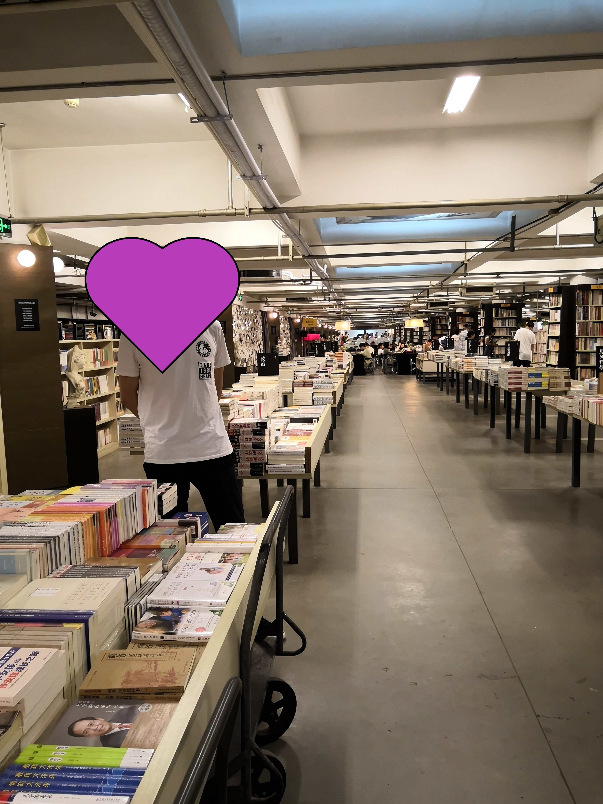
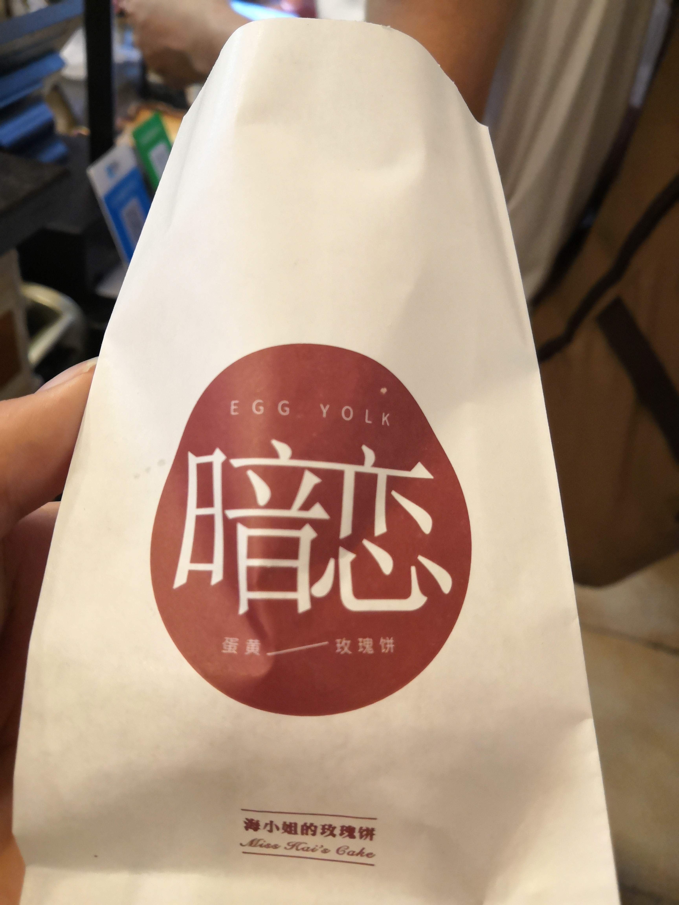

#### 南京苏州四日游游记

> ###### 注：仅作记录，留作以后回忆。

##### ex Day(2019-05-10) 碰面

- 朋友从北京赶来，由于苏州没有机场，商量后决定在南京见面。顺便在南京玩两天。
- 他下午四点的飞机，原定6点20到南京，不出意外，晚点一个小时。我四点多就到了宾馆，等到大概八点，还以为飞出地球了？原计划晚上打算吃海鲜自助，也泡汤了。延迟到第二天晚上。
- 晚上围着宾馆附近绕了一圈，随便找了一家餐馆（人还不算少），点了一份萝卜丝（尼玛，就是泡菜萝卜），一份皮蛋（味道完败学校附近的一家饭馆，关键在于酱汁，再配合些许的辣椒粒和拍的黄瓜，完美。 它家的酱少了一点甜味），鱼香肉丝（哎，也不好吃。第一次遇见，配菜放的应该是笋丝吧，两者感觉没法融合啊，不过笋丝还是挺好吃的。还是喜欢木耳，胡萝卜作为配菜。查了一下，很可能用的是玉兰丝），炸鸡。价格还好吧，将近100.

##### Day01 (2019-05-11) 启航

###### 先锋书店

- 上午，第一站，先锋书店五台山总店。传说中最美的书店，来一探究竟。

- 树阴下的书店：

  

- 南京经典的景点明信片：

  

- 网上说书店是由地下车库改装的，书店内有一个坡道，抬头可以看到十字架，由很多游客都在拍照，我此处略过了。

- 书店内部的大体布局:

  

- 书店里边有一面特别的墙，游客写下的一番感触，大都是情话。。似乎书店是他们成长的见证者，有两情相悦，有爱而不得，有南京美景，有回味生活，每一封都承载不同的记忆。艺术墙这还可以听到天空之城的八音盒伴奏，看着一封封留言，听着一缕缕的旋律，一步步漫走，这可能就是书店对游客的魅力之一？我倒是撒了撒眼，倒是没有看到计算机相关的书籍，嘿嘿。

	
	
###### 钟山风景区
- 做地铁到苜宿园，直接就到景点，交通很方便。花了大约6个小时时间，还没玩完。大部分时间都在赶路，景点与景点之间离得可不近。可以考虑坐车赶路，走着确实很累。买了套票：美龄宫---灵泉寺---中山陵---明孝陵。哎，时间来不及，最想去的紫金山，放弃了。

- 山中的肯德基爷爷：

	
	
- 美龄宫地图，老毛病，没地图不踏实。。美龄宫四层（-1到4）？，地下室主要就是烧水的，澡堂，特工和仆人住的地方吧；一楼也差不多；二楼中间是正餐厅，旁边是办公的地方；三楼是卧室吧，由主卧和次卧两个；这一层还有对蒋和宋的历史简介；四楼还有个小教堂（基督吧），还有一个书屋，看来无论到什么高度，书永远都离不开啊。
	
	
	
- 蒋介石专门为宋美龄订制的项链：
	
	
	
- 接下来，就赶着去灵泉景区了。路上买了点鸡排，甜筒补充下体力，价钱和平常价格一样吧，毕竟这里也是开放景区，只有几个收费。貌似都不收费，好像可以免费预约。还有过了下午5点，免费开放，有兴趣自行了解。从美龄宫到灵泉景区，估计走了一小时？真远。。
- 老规矩，灵泉景区地图如下：
	
	
	
- 印象深刻的就是灵谷塔了，毕竟登高望远嘛，站在高处风景独好。请欣赏，哈哈。
	
	
	
	
	
	
	
- 出塔后，倒是有个小插曲。为了图方便，自己找的小路走的，走着走着感觉越来越荒凉，感觉不太好。果然，突然出现一道门。你这不过分嘛！还好门不高，嘿嘿。实例教训，出去玩尽量跟着人群走吧。不过不浪一浪不好玩，嘻嘻。（我吐槽一下景点啊，有些不算小的景点，你就设一个出口，我原路返回多没意思啊。）沿着路继续走，就到了孙中山纪念馆。
	
	
	
- 钟山假日音乐会，鸽子不少，可以买点吃的，和鸽子来次亲密接触。
	
	
	
	
	
- 接下来，大概四点了，算了下可能时间不太够（计划6.30去吃海鲜自助，所以）要赶往中山陵了。中山陵，我觉得一点意思都没。登过一节节楼梯后，围着孙佬塑像转了一圈，结束了（无意冒犯啊）。？？？就这，还是我没get到灵魂，人还贼多。心疼我没去紫金山啊。不过啊，登顶后看风景还是很不错的。
	
	
	
	
	
- 接下来就是我们计划的钟山风景区的终点站明孝陵了。实在是太累了，没心情完了，心早就跑到自助餐那里了。此刻我只想坐上地铁，享受自助。回去的路上随手拍了几张。
	
	
	
	
	
	
	
	
	
- 上车啦，迫不及待赶往餐厅。票路上早早就买好了（可以考虑试下淘宝，说不定会有惊喜，蚊子腿也是肉？）。什么，前边还有18桌？WTF。实在懒得再找了，还是老老实实等着吧。等了大概四十分钟吧。还好最终体验还不错，要不然，哼！（手机也快没电了，只顾吃，忘记拍照了。多伦多，可以自己看看。）吃自助，就怕猪一样的队友（~ ~ ~）。吃自助可别客气，自己拿自己的好吧！我朋友第一次吃，不太适应，可是真“疼”我，海鲜拿过来后，基本上就交给我了。。。还好绝大部分是虾。感觉自己一整场都在剥虾。。快到宾馆的时候，他居然告诉我，咱们去买点吃的吧，他居然说他还想吃点东西？？我只想说，	
	​		
		**火腿肠真香，哈哈。**
- 期间也去东大四牌楼，南大鼓楼校区转了转。“果然是老校区？灯都没了啊，晚上跑去，一盘漆黑。”
	
	
	
	
	
##### Day02 (2019-05-12) 

###### 玄武湖公园
- 早餐，吃的老卤面。面个人觉得不太好吃，有硬心。汤也没有出彩的地方，就感觉是酱油稀释一下，感觉不如我伴着生抽好吃。
	
	
	
- 又是一个庞大的景点，进门后，就犯了一个错误（不喜欢踩坑的，跟着人流走，一般没错）。向北边走绕一大圈，再到小岛上。废了很大功夫，最后发现好玩的都在小岛上，从大门直接过来就好，绝望。向北边没什么亮点，而且走着走着没树了，还是中午，热，原本就累，GG。还好有共享单车，可是走着走着，就遇见了立交桥，骑车子最怕碰到立交。这次我就机智了，果断跟着人群走再和目的方向一致，完美解决。美中不足的是，这么大个公园，你，你居然，不让我骑车。都走一半了，半吊子了，我能怎么办，只能继续走了。这一段没有树，走的很难受。看会风景吧。

	
	
	
	
	
	
	
	
	
	
	
	
	
	
- 玄武湖公园大概玩了一半吧，有点饿了，出去觅食了。路上偶然看到的风景：
	
	
	
- 原计划直接去夫子庙，朋友临时决定加一个总统府。咦，我觉得总统府附近有条商业街比总统府好玩。商业街里还有一条mini小火车道，夜景应该不错。可是只顾找总统府，忘记拍照了，哎，错过的才最美好的？出去玩嘛，有些有名的景点不去后悔，去了也会后悔，那还是要去的，要不然你怎么知道你会后悔？（滑稽）

	
	
	
	
	
	
	
	
	园林艺术还是要来苏州~ ~
	
	

- 骑单车一路南下，去夫子庙喽。来南京秦淮风景还是要看看的。一条文化气息丰厚的商业街。在这吃了一次，网红食品-榴莲芝士饼。就是榴莲味的匹萨吧，热的时候饼很脆但是榴莲味道浓，吃第二块的时候特别腻；凉的时候，感觉味道更好点。芝士的分量太足了，榴莲没什么参与感。之前吃过千层榴莲蛋糕，冷藏之后，食用，味道极佳。

	
	
	榴莲芝士饼
	
	
	
	
	
	
	
	
	
	
	
	
	
	

- 白鹭公园。原本只是计划路过这里去南边的地铁站，顺便兜兜风。特意看了看地图，它确实有个南门。没毛病，人算不如天算啊，走着走着，路倒是有，但是又是被门挡了。无奈之下，只能另寻他路了。赶往南京南，苏州走起。时间刚刚好，赶上苏州倒数第二班的地铁，yes。
	
	
##### Day03(2019-05-13) 

###### 拙政园和狮子林，平江历史文化街区
- 前两天，莽夫过头了，好累啊。接下来，园林之旅，更注重体验，赏风景，边走边拍。苏州博物馆附近的餐馆，早餐：馄饨（确定这不是饺子吗！），蒸饺。拙政园票价有点小贵，玩完之后觉得不太值，来这里写生的人倒是不少。羡慕可以从事音乐啊，绘画啊等艺术创作的人们，未来尽量选择和自己的爱好相关的职位。

	
	
	
	
	
	
	

	此处盆景倒是挺好看的

	

- 狮子林的假山，好玩。绝对是捉迷藏的好地方。1个多小时，都在围着假山转来转去，爬高上低的。

	地图在手，不迷路。	
	
	
	
	
	
	你能看到几头狮子呢？
	
	

	
	
	
	
	
	
	
	
	
	
- 在网上找了几家吃的，从平江这里骑车跑到了西中市那边。嘿，有额外的惊喜。在苏州，饭店都给人艺术的气息。菜都非常精致 ，葱油拌面还是很好吃的。卤汁不太喜欢，太淡了。难道苏帮菜都是有点偏甜？还好有个夫妻肺片，辣辣的，调和一下。

	 
	
	
	
	
	
	
  
    
  
    
  
    
	
- 悄然发现新的美景，意外之喜。原来这附近就是山塘街。
	
	
	
	
	
	
	
- 找地铁，坐到苏州中心，看一看金鸡湖夜景。看一看”秋裤楼“。晚上来这边，尽量穿厚点吧，风很大。苏州这边昼夜温差感觉还是很明显的。
	
	
	
	

	金鸡湖酒店吧，真气派
	
	
	
	为什么还特意给单车一个镜头呢？记忆深刻啊，蹬了一个多小时。苏州这边，单车比较坑。你虽然到目的地了，可是你的车子没有（必须把车停在特殊的车桩上，关键地图上也不显示，这就导致了，你不熟悉的话，压根不知道下个车桩在哪里）！！从金鸡湖西入口一直骑到了邻瑞广场，我是沿着178路线骑的，这一路我都没看到桩。
	
	

##### Day03(2019-05-14)  落幕

###### 独墅湖公园，苏州博物馆，平江历史文化街区，苏州火车站
- 独墅湖公园这，风景特别棒，还有个基督教堂，每次来都可以遇见拍婚纱照的。这次也不例外， 还不少，遇见了大概六对。

	
	
	
	
	
	
	
	
	
	
- 对了，拙政园，苏州博物馆现在还需要提前一天在网上预约（如果当天人少，也可以当天约）。苏州博物馆是由贝聿铭先生设计的，理念是“中而新，苏而新”。苏州博物馆和忠王府，拙政园，狮子林紧邻，要突出园林理念还要保持现代建筑风格。粗略欣赏一番。艺术的眼光，看博物馆，[见此](https://www.zhihu.com/question/34382394)

	
	
	
	
	
	
	
	
	
	
- 接下来在平江那里转了一两个小时，感受姑苏的魅力。

	
	
	
	
	
	
	
	
	
	
	蛋黄的玫瑰饼，味道很赞。个人感觉，原味的没有蛋黄的好吃，原味的吃一个就会腻。蛋黄的刚好会中和一下腻味。除了贵点没毛病，穷是我的错（囧）。
	
	
	
	
	
	
	
	

- 听说珍珠饭店挺有名的，慕名而去。一直都在吃，是真的不太饿，汉。最后剩了不少，罪过罪过。旁边的小哥哥小姐姐，你俩在笑什么？~ ~ 为了逼迫对方多吃点，咱俩这扯皮也是醉了，哈哈。

	
	
	原来你是按块卖的啊啊。真的，这是一份的量。
	
	
	
	少不了经典的葱油拌面。好吃。
	
	
	
- 散会步，继续逛了一会平江。

	
	
	
	
	
	
- 送君去车站。期待下次再见。金陵两日，从先锋书店，东大四牌楼，南大鼓楼，从美龄宫，灵泉景区，中山陵到明孝陵；次日玄武湖，总统府，夫子庙和秦淮河；姑苏现有，拙政园，狮子林，平江，偶遇山塘街，金鸡湖夜景；再到苏州博物馆，平江重游，结于苏州火车站。一路上吃喝玩乐，尽情玩耍，意犹未尽。再会了。

	