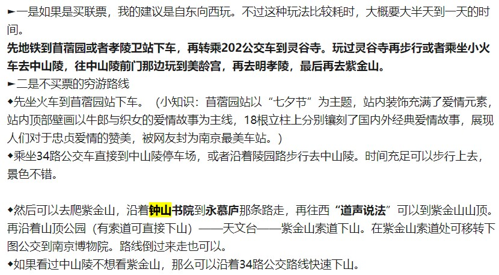

##### 南京经典筛选

- 鸡鸣寺（樱花没了。之前3月份去樱花大道，樱花正盛）->明城墙（不好玩）->狮子桥（小吃街）->先锋书店五台山总店->南京大学鼓楼校区（东大四牌楼校区）
- 雨花台（雨花阁和**方孝儒墓**，2h， 可以考虑沿着雨花阁--江南第二泉--乾隆御碑---雨花台纪念碑---雨花台烈士纪念馆---雨花台南门的路线）------夫子庙，秦淮河（夜景，2h）-----白鹭洲公园（2h）----老门东（1h，觅食觅食，上次找了好久，没看到吃的很大啊啊啊，**蒋有记锅贴，小郑酥烧饼，蓝老大糖藕粥，陆师傅梅花糕，鸡鸣汤包**）-----先锋书店（老门东店）
- 玄武湖，南京博物馆，南京图书馆

##### 19.04.10 

- 大概晚8点出发，先去最美的四牌楼校区----先锋书店五台山总店（优先）或者南大鼓楼校区或者南京师范

##### 19.04.11

- 先去鸡鸣寺（1h）----狮子桥（觅食）----钟山风景区

  -----晚上在南京站住宿（顺便看看夜景）,可以考虑去南京林业

##### 19.04.12

- 玄武湖---总统府或者去南京图书馆----夫子庙，秦淮河（夜景，2h）-----白鹭洲公园（2h）----老门东（1h，觅食觅食，上次找了好久，没看到吃的很大啊啊啊，**蒋有记锅贴，小郑酥烧饼，蓝老大糖藕粥，陆师傅梅花糕，鸡鸣汤包**）-----先锋书店（老门东店）
- 晚上最晚南京南高铁10:07

##### 苏州经典筛选

- 参考  [1](https://www.zhihu.com/question/32263459/answer/57721185)

- **山塘街**，**苏州博物馆**，**金鸡湖景区**（夜景），观前街，拙政园，留园，平江路，桃花坞，斜塘老街，吴趋坊（吃吃吃），**诚品书店**
- 吃的：
  - 一定要去吃的，答应我，你们去吃临顿路的哑巴生煎！！！一定要去吃！！！！那必须要去
  - 去山塘街松鹤楼吃顿苏帮大菜吧，钱要舍得哦，好菜上大众点评自己看。
  - 什么？钱不够？到十全街老苏州茶酒楼，一样正宗，价格稍好一些。
  - 什么 ？钱还不够？到凤凰街协和酒楼，环境差点，一样正宗，价格更好。
  - 什么 ？钱还不够?大众点评看看苏州大饭堂，量小品种多，随便吃吃。