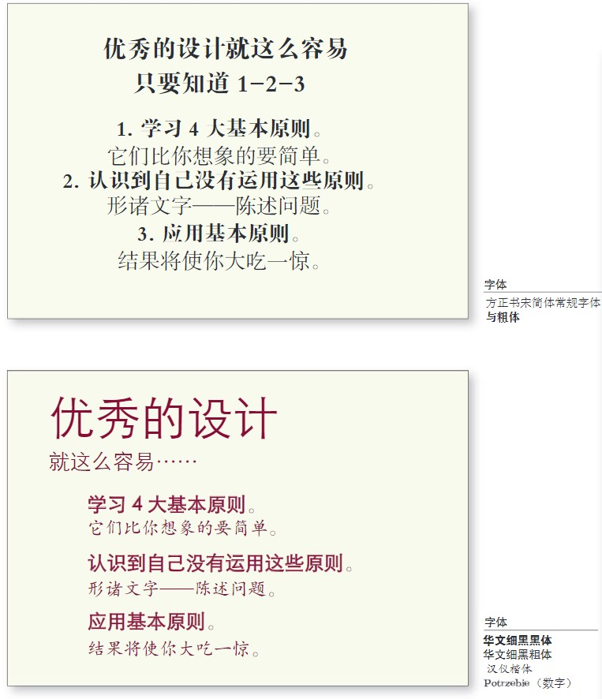

## Part01 设计原则 CH01-CH08 

### CH01 引言

- 一旦能够说出什么东西的名字，就会很容易注意到它。你就会掌握它，拥有它，让它受你所控。

#### 4大基本原则
1. 对比
	避免页面上的元素太过相似。
2. 重复
	可以重复颜色，形状，材质，空间关系，线宽，字体，大小和图片，等等
3. 对齐
	任何东西都不能在页面上随意安放。
4. 亲密度
	彼此相关的项应靠近，归组在一起。
	
### CH02 亲密性
