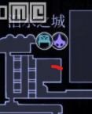
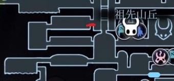
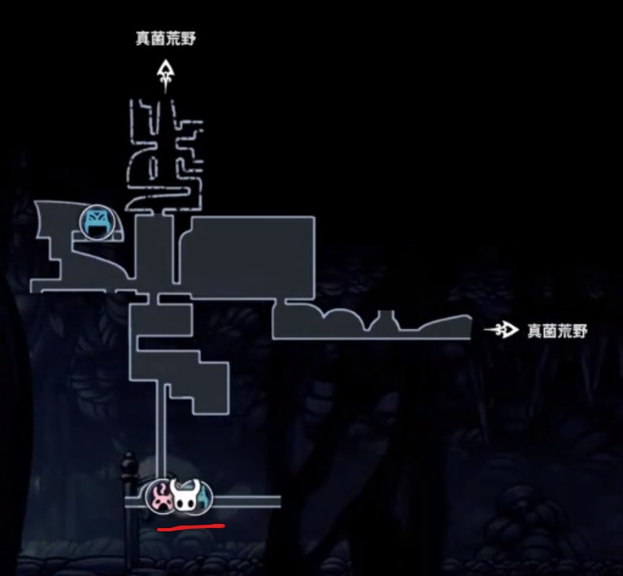
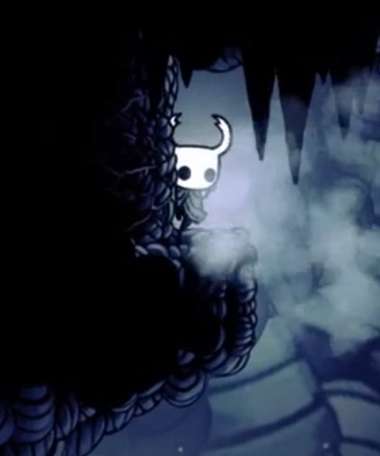
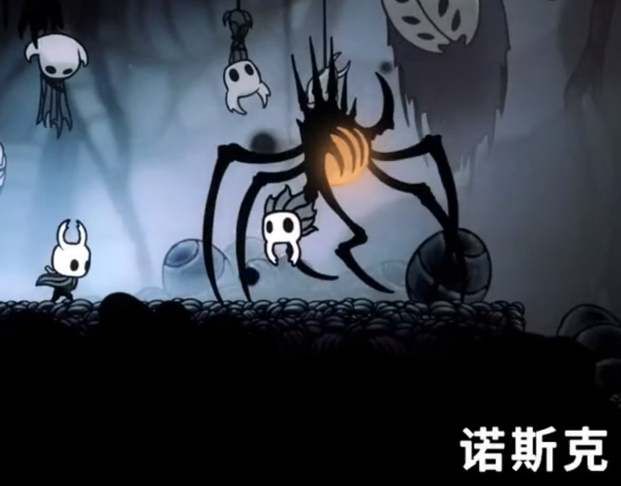
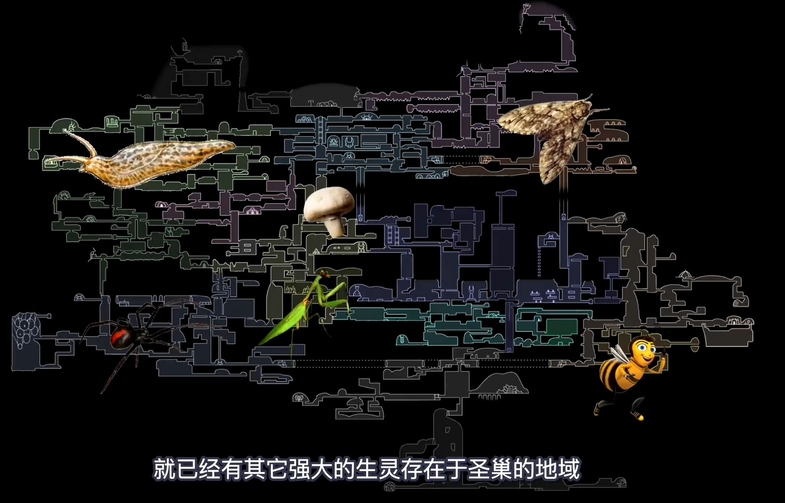

#### 空洞骑士

##### 路线推荐

- 11，探索下水道，蜂巢
- 12，探索女王花园
- 13，14，15，探索爱之塔，世界旅行（救虫子）

##### 螳螂村

- 打完BOSS，拿到**螳螂爪的徽章（骄傲印章，增加骨钉的攻击范围，前期很重要）**，圣朝印章（可以卖钱），右边有两个隐藏房间还有钱和存档
- 顺便救一个小甲壳虫，迷妹（当男主为偶像）。

##### 苍绿之径

- 拿到**蓄力斩（强力劈砍）**，（需要超级冲刺。）

##### 泪城

- 左下角，找到**铁匠（修复一次，强化三次，强化需要苍白矿石）**。

- 有一个**商人**。

- 使用简单钥匙，打开**皇家水道**

- 还有一把简单钥匙（大概在下图位置）

  ​	

##### 灵魂圣所

- 击败BOSS，获得**荒芜俯冲**

##### 皇家水道

- 一个生命碎片
- 需要**下踩**，**超级加速**
- 先打BOSS，将闸门打开，放酸水。在去最右边拿到**伊斯玛的眼泪，可以在酸水中行走**

##### 遗忘十字路

- 隐藏BOSS，一个生命碎片
  - 位置
  - 
  - 上图绿色横线处，也有一个生命碎片。

##### 水晶山峰 圣巢巅峰

- 一直向右走，没路向上走，去拿**梦之剑**
- BOSS，左边有一个**店主钥匙**
- 最右边，找到**水晶之心**（**超级冲刺**）。
- 左边，还有两只虫子（一只被打死了。。）
- 后期收集虫子可以来拿**暗影降临**
- 圣巢巅峰有一个苍白矿石。

##### 石之庇护所

- 杀BOSS ，梦境值200；右边还有一个生命碎片

##### 雾之峡谷

- 拿**灵魂尖啸**
- 拿完可以在酸水中行走之后再来， **教师档案馆**，上边还有**徽章插槽**

##### 教师档案馆

- 此处有个梦境BOSS，两只眼睛的，教师。

##### 安息之地

- 200梦境值时候，右边会新开一个地图，有个梦境树还有一个国王神像。

- 收集到300梦境值，NPC会给一个**苍白矿石**

##### 深巢

- 从螳螂堂口进入深巢，**第一个口向上边走**，找到地图师。

- 一直往下走，找到存档点（温泉处,下图标记为红色的地方），向右边走是远古盆地（需要车票）。向左边走，**拿车票以及主线任务，还有苍白矿石**（需要大冲或者二段跳隐藏BOSS，温泉一直向左走，左上角有个隐藏墙，记住里边还有一个隐藏墙）；一直向左走，找到鹿角车站。有梦之树，还有个梦BOSS（200梦境值）。隐藏关卡（**编织者巢穴**）。

  - 

  - 隐藏墙，如下

    

  - 隐藏BOSS

    

  - 泉水右上边，有一个能量碎片，此处困难。

##### 远古盆地

- 下，右边有地图商人，拿**二段跳（帝王翅膀）**，苍白矿石

##### 真菌荒地
- 拿到**蘑菇孢子**

##### 王国边境

- 地图位置（[链接](https://www.bilibili.com/video/av9107537) 22min），贴着左边走。
- 斗兽场，第一次碎片，第二次**苍白矿石**。**国王印章，冲刺斩（剑技），快速劈砍**

##### 深渊

- 从古老盆地来这里，需要**国王印章（在王国边缘获取）**
- 拿**暗影尖啸**，左下角。
- 最右边拿**暗影披风**（可以穿越黑影）

##### 蜂巢

- 能力，需要**贴墙跳，最好还有二段跳**
- 有一个蜂巢之血和一个生命上限；还有两只虫子，一个入口特别难找，一个需要从其他地方进入

##### 女王花园

- **爱之塔钥匙（顾名思义，去爱之塔的钥匙）**，还有一个梦境BOSS（打他会弹，挺好打的）

##### 爱之塔
- 在王国边境和国王驿站交界处

##### 白色宫殿

- 需要**觉醒的梦之剑**，在隐藏的鹿角站左边，用觉醒的梦之剑砍骑士。
- 关卡设计的极难。熟悉节奏，熟悉节奏，还好。
- **难道另一半的白色徽章，合成国王印章，然后带着这个印章，去深渊最下边，做剧情**

---------------------------

#### 剧情解读 [链接](https://www.bilibili.com/video/av41970130?from=search&seid=4666111727900472456)

- 剧情故事元素多样化：

  - 格斗，背叛，喜剧，悲剧，令人产生共鸣的角色，多重结局，许许多多的两性内容
  - 但是都阐述的非常微妙（说的云里雾里，不正经说话，都是暗含）

- ##### 先创造游戏世界，然后再写剧情

  - 先写所有的地图，关卡，boss，游戏机制，再根据这些元素写剧情

- 三种力量：
  - 灵魂，一种白白的黏糊糊的流体；
    - 法术攻击；恢复生命；源自动物活体
  - 虚空，一种黑黑的黏糊糊的流体
    - 主角就来源虚空，其只能在“深渊”找到
  - 精华（梦境树或者梦境BOSS）
    - 梦境中释放的光芒

- 从巴东或者其他地方得知，这个变形的沃姆就是苍白国王（简称白王，圣巢的创造者与统治者）
  - 
  - 辐光（The Radiance），游戏中真正的最终BOSS和主要敌对势力，蛾类生物，与精华有一些相似之处