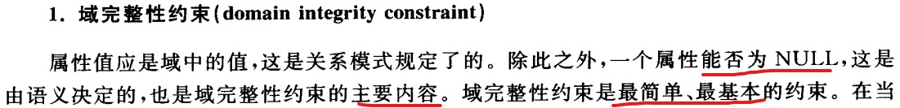
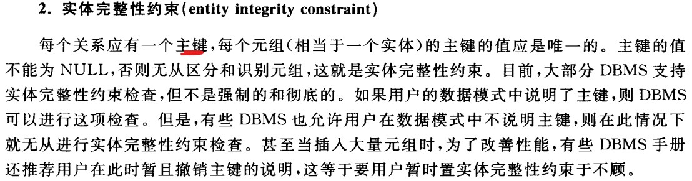
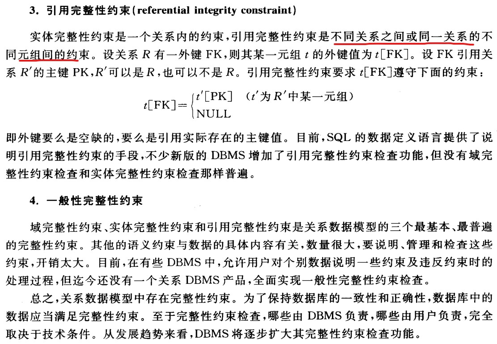
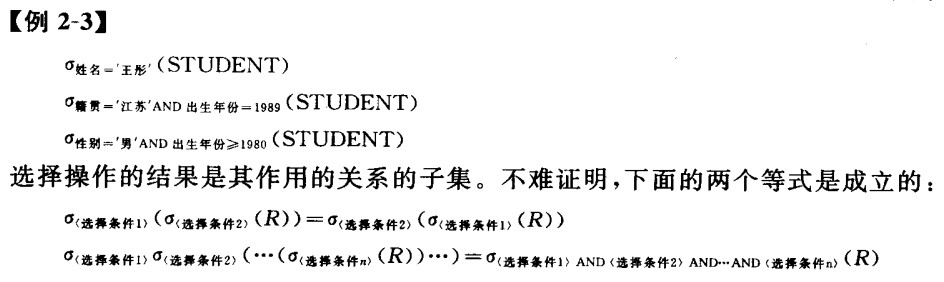
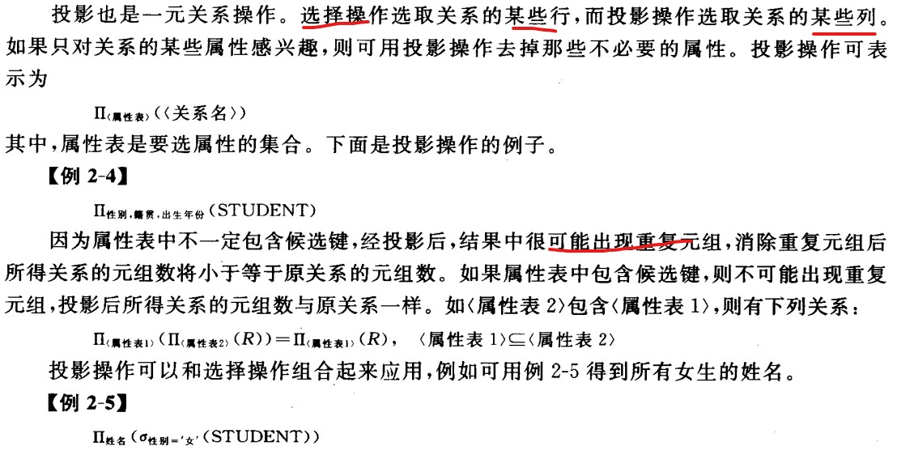
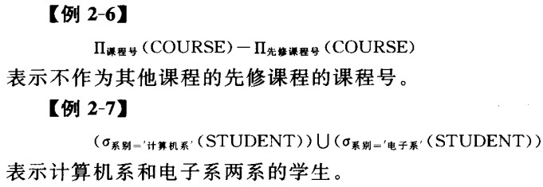
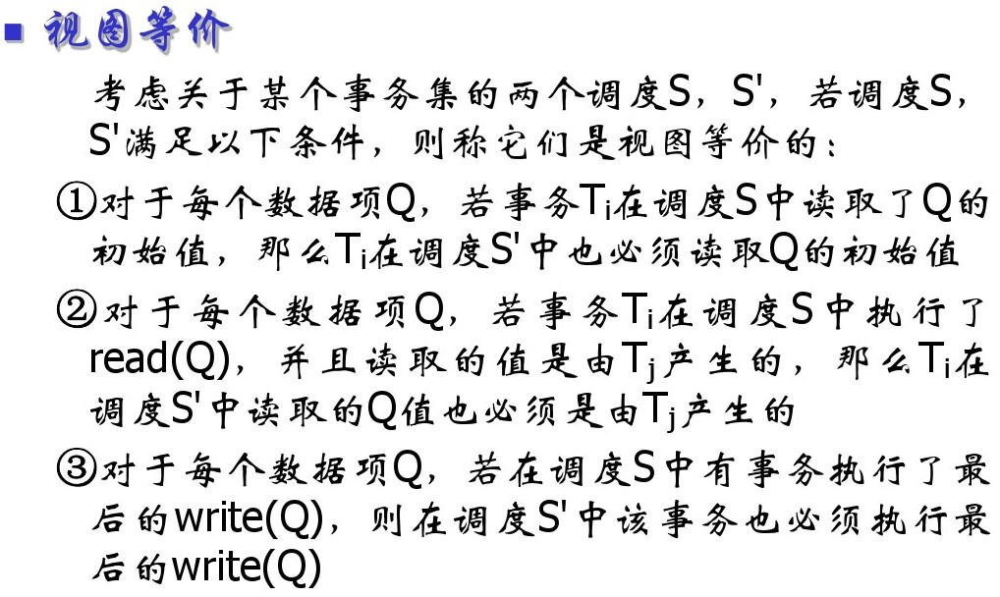
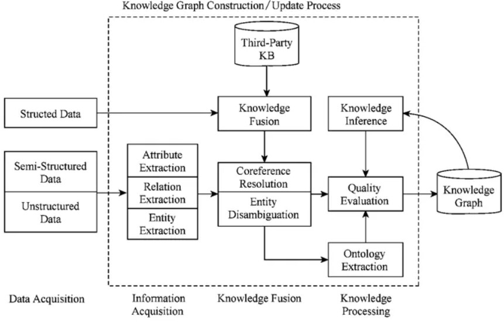
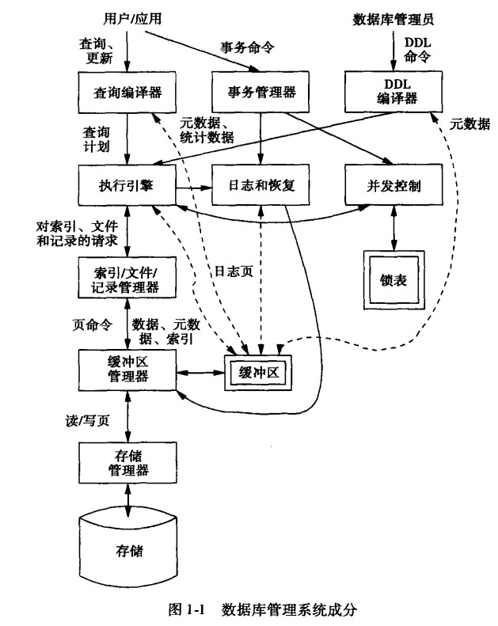

### 数据模型

- P24
- 数据是实体和他们之间关系的表达。
- 数据的结构（表格），数据的操作（关系代数），数据的约束

### 关系数据模型
- P38
- 什么是关系？

- 显式关系： 关系（表格），关系的关系（表格之间的关系）
- 蕴含关系：逻辑蕴含
- 隐藏关系：概率推断

- 约束（域，实体，引用）
 
 
 

- 操作
	- 选择操作
	-  
	- 投影操作
	-  
	- 集合操作
	-  
	- 连接操作 join
	-  
	-  

- ER图：实体联系数据模型
	- 凡是可以互相区别而被人们认识的事，物，概念等统统抽象为实体。具有共性的一类实体可以划分为一个实体集。
	- 实体一般具有若干特征，称为实体的属性。
	- 实体之间的各种关系称为联系。

### 事务
- P106
- 原子性 Atomic
	- 要么不做，要么全做。

- 一致性 Consistency
	- 数据库中的数据满足完整性约束。

- 隔离性 Isolation
	- 多个事务并发地执行，应像各个事务独立执行一样。

- 持久性 Durability
	- 数据库因故障而受到破坏，其也应该能够恢复。

### 数据库的存储结构 P113
- 活动头磁盘的存取时间由三部分构成，寻道时间（主要），旋转延迟时间和传输时间。固定头磁盘每个磁道都有磁头，寻道不必移动磁头。

- 物理块在磁盘上的分配，一般有4种 P116
	- 连续分配法，类比数组
	- 链接分配法，类比链表
	- 簇集分配法，上边两种的结合。簇集以指针链接，簇集是指物理上邻接的若干物理块。
	- **索引分配法**，每个文件有一个逻辑块号与其物理块地址对照的索引。这种方法比较灵活，扩充修改也比较方便。但逻辑上相邻的物理块不一定在物理上是邻接的，连续访问数据时性能不高。

- 文件的基本类型 P119	
	- 1. 堆文件 
	- 2. 直接文件
	- 3. 索引文件
		- 主索引，次索引
		- 非稠密索引，稠密索引 

- 动态索引 P124

  - 静态索引是一个多分树，而动态索引是一种平衡多分树，B树。 
  - [B+树原理](https://github.com/CyC2018/CS-Notes/blob/master/docs/notes/MySQL.md#b-tree-%E5%8E%9F%E7%90%86)
  	-  基于B树和叶子节点顺序访问指针实现。
  	-  查找时，首先在根节点进行二分查找，找到一个key所在的指针，然后递归地在指针所指向的节点进行查找，直到查到叶子节点，然后在叶子节点上进行二分查找，找到key对应的data。
  	-  插入，删除操作需要调整以维护平衡
  	-  优点：
  		-  查找时间复杂度等于树高log d N，d为每个节点的出度。
  		-  利用磁盘预读特性。操作系统一般将内存和磁盘分割为固定的块，每块称为一页，内存和磁盘以页为单位交换数据。

 	- 哈希索引
 		- 能以O（1）时间进行查找，但是失去了有序性。
 		- 无法排序与分组；只支持精确查找，无法用于部分查找和范围查找。 

	- 索引的使用条件：
		- 对于非常小的表，大部分情况下简单的全表扫描比建立索引更高效。
		- 对于中到大型的表，索引就非常有效。
		- 对于特大型的表，建立和维护索引的代价将会随之增长。此时可用一种技术可以直接区分需要查询的一组 数据，而不是一条记录一条记录地匹配，例如分区技术。 

### 查询处理和优化  P135
- 查询优化途径
	- 对查询语句进行变换，如改变基本操作的次序，称为代数优化。最常用的变换原则是，尽量缩减查询过程中的中间结果。如，让选择和投影先做，再做连接等二元操作。
	- 根据系统所提供的存取路径， 选择合理的存取策略，如选择顺序搜索还是索引，这称为物理优化。
	- 有些查询优化仅根据启发式规则，选择执行的策略，如先做选择，投影等一元操作，后做连接等，这叫规则优化。
	- 还有一些可以对可供选择的执行策略进行代价估算，从中选择代价最小的执行策略，这叫代价估算优化。
	- 优化数据访问
		- 减少请求的数据量，如只返回必要的列或行 ，缓存重复查询的数据
		- 减少服务器端扫描的行数，如使用索引
	- 重构查询方式 
		- 切分大查询 ，分解大连接查询

### 事务管理 P155
- 保证事务在故障时满足ACID准则的技术称为恢复；保证事务在并发执行时满足ACID准则的技术称为并发控制。这两项合称为事务管理。
- 
- 并发的目的
	- 改善系统的资源利用率和吞吐率（单位时间内处理的事务数） 
	- 改善短事务的响应时间（长的在前执行，短的等的太久。）

- 并发所引发的问题
	- 丢失更新，写写冲突
	- 读脏数据，读写冲突
	- 读值不可复现 ，读写冲突

- 并发控制的正确性准则
	- 调度S是对n个事务的所有操作的顺序的一个安排。同一事务集，调度可能有很多种 。
	- 如果其中两个调度S1和S，在数据库的任何初始状态下，所有读出的数据都是一样的，留给数据库的最终状态也是一样的，则S1和S2是等价的。目标等价和冲突等价。注意，冲突等价一定属于目标等价。
	- 不冲突的操作分为两类，1.一对操作都是读； 2. 虽然有写，但是作用的数据对象不一样。
	- 凡是通过调换S中不冲突操作所得到的新调度，称为S的冲突等价调度。
	- 对于事务集，如果一个调度与一个串行调度等价，则称该调度是**可串行化的**。
	- 

### 完整性约束 P197
- 静态约束
  - 固有约束，如关系的属性是原子的，即满足第一范式的约束
  - 隐含约束， 如，域完整性，实体完整性，引用完整性约束。
  - 显式约束

- 动态约束，不是对数据库状态的约束，而是数据库从一个状态到另一个状态时应遵守的约束。如，年龄一般只会增加，不会减少。动态约束一般也是显式约束。
- 隐含约束的说明在CH03
- 显式约束的说明。下边四种方法
  - 用过程说明约束，把约束的说明和检验推给应用程序。
  - 用断言说明约束 
  - 在基表定义中加check子句约束
  - 用触发子表示约束  CH09

### 数据库和知识图谱
- 知识图谱，开放和半结构（模式灵活）
	- 知识图谱是一种数据模型，将世界上的知识组织成为 实体和实体之间的关系。
	- 知识图谱首先要定义一个关系规则，关系规则定义了不同类别的实体之间可以存在的关系。一条关系就是一条边，连接两个实体（顶点）。
	- 优点，知识推断补全，语义理解能力
	- 
- 数据库，一致性，可拓展，效率，封闭，结构化（效率和拓展性）
- 效率损失的解决方法
	- 索引和视图
	- 查询优化，语义重写
	- 分布并发：大数据键-值 存储模式

- 为什么需要知识图谱？ [参考](https://zhuanlan.zhihu.com/p/31726910)
	- 数据量越来越大，人们处理困难，而机器又无法获取网络文本的语义信息。为了让机器能够理解文本背后的含义，我们需要对可描述的事物（实体） 进行建模，填充它的属性，拓展它和其他事物的联系。即，构建机器的先验知识。
	- 知识图谱是由一些相互连接的实体和他们的属性构成的。知识图谱的数据来源有三个：结构化数据，半结构化数据和非结构化数据。

### 数据库和区块链
- 数据库，一致性，可拓展，效率，中心化
- 区块链，共识，无需信任，去中心化（防抵赖，防篡改，可追溯，签名机制）
- 区块链数据库的特征：
	- 描述性的接口
	- **可编程去信任机制 **
	- **异构一致性/共识性语义**
	- 可拓展性
	- 并发事务调度和高吞吐

### 数据库和深度学习
- 数据库，一致性，可拓展，效率，显式结构（确定的，语法匹配）
- 深度学习，高维，不确定，隐式结构（不确定的，语义匹配）
- 数据库和深度学习
	- 提高训练效率
	- 提供知识编码
	- 自动化DBA
	- 语义索引
	- 传递关系编码 

### SQL
- structured query language，用于存取数据以及查询，更新和管理关系数据库系统。

### 数据库的实现
- 