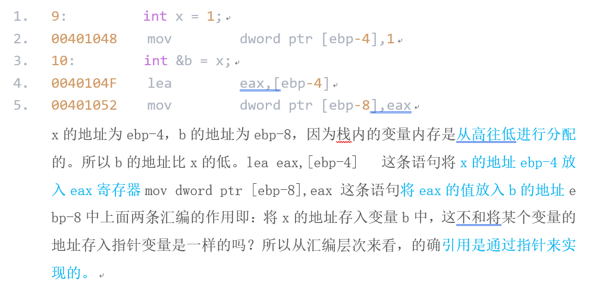
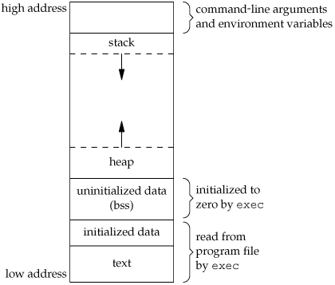
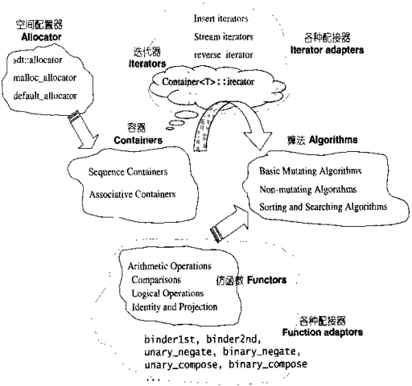
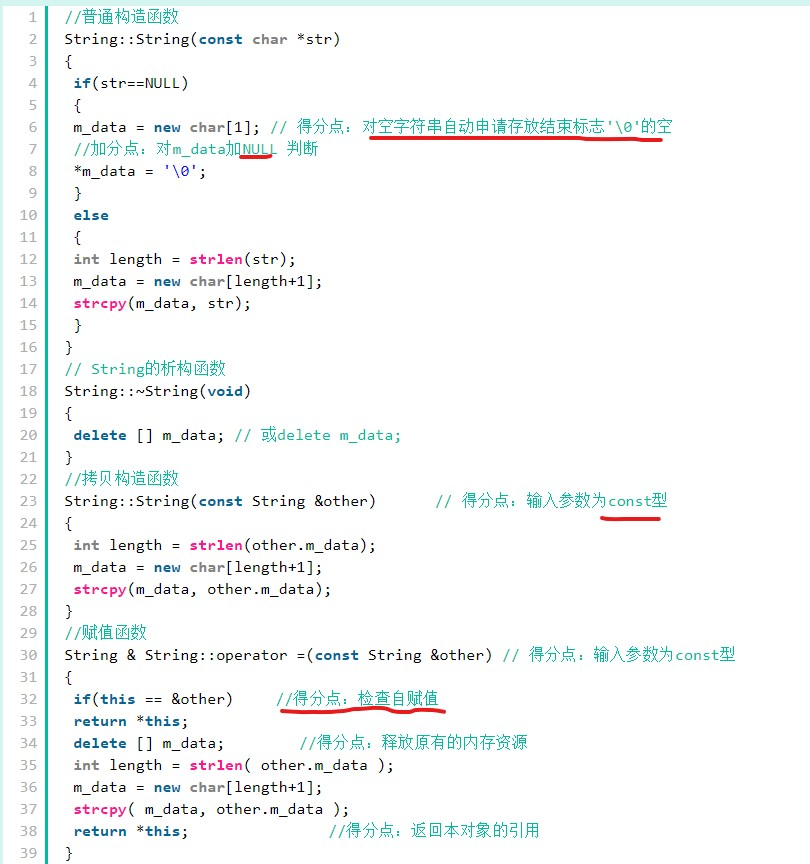

利用笔记写下你在面试中打算怎么回答某个知识点，可以从四个步骤来回答：

- 为什么存在（解决了什么问题）
- 基本原理
- 使用场景
- 和其它技术的对比

1. 变量声明和定义的区别？
     分配 空间？可以多处声明，外部变量extern，定义一次。

2. C和C++的区别？

  - 设计思想上：

       C++是面向对象的语言，而C是面向过程的结构化编程语言

  - 语法上：

       C++具有重载、继承和多态三种特性

       C++相比C，增加多许多类型安全的功能，比如强制类型转换、

       C++支持范式编程，比如模板类、函数模板等

3. 注意浮点数的零值。

4. strlen和sizeof区别？
     运算符和函数；sizeof可在编译期间得到结果，**不能用来得到动态分配（运行时分配）存储空间的大小**。

5. 同一不同对象 可以互相赋值吗？
     注意深拷贝和浅拷贝。
       . 

6. 结构体内存对齐问题？
     内容还有很多，可以手动调整。默认按结构体中变量size最大的成员对齐。[参考](https://www.zhihu.com/question/27862634)

     - 前边的地址必须是后面的地址整数倍，不是就补齐
     - 整个struct的地址必须是最大字节的整数倍

7. static作用？[静态成员](https://zh.cppreference.com/w/cpp/language/static) [存储类指定符](https://zh.cppreference.com/w/cpp/language/storage_duration)
     修饰变量，函数（类成员函数和成员变量）。

     - 函数体内static变量的作用范围为该函数体，不同于auto变量，该变量的内存只被分配一次，因此其值在下次调用时仍维持上次的值

     - 保存至静态区，只在本文件在可见。**隐藏**。函数的定义和声明在**默认情况下是extern的**，但静态函数不是。
     - 类中的static函数没有this指针。故static成员函数只能访问static修饰的类成员。static成员函数不能被virtual修饰。虚函数的实现是为每一个对象分配一个vptr指针，而vptr是通过this指针调用的。虚函数的调用关系，this->vptr->ctable->virtual function
     - static数据成员，类内声明，类外定义。
       - 静态数据成员不关联到任何对象。即使不定义类的任何对象它们也存在。整个程序中只有一个拥有静态[存储期](https://zh.cppreference.com/w/cpp/language/storage_duration)的静态数据成员实例，除非使用关键词 [`thread_local`](https://zh.cppreference.com/w/cpp/keyword/thread_local) ，该情况下每个线程都有一个拥有线程存储期的该对象 (C++11 起)。
       - 静态数据成员不能为 mutable 。
     - 静态成员函数
       - 静态成员函数不关联到任何对象。调用时，它们无 this 指针。
       - 静态成员函数不能为 virtual 、 const 或 volatile 。（[为什么不能是const？](https://blog.csdn.net/crazy_programmer_p/article/details/38904581)）
       - 静态成员函数的地址可以存储在常规的[指向函数指针](https://zh.cppreference.com/w/cpp/language/pointer#.E6.8C.87.E5.90.91.E5.87.BD.E6.95.B0.E6.8C.87.E9.92.88)中，但不能存储于[指向成员函数指针](https://zh.cppreference.com/w/cpp/language/pointer#.E6.8C.87.E5.90.91.E6.88.90.E5.91.98.E5.87.BD.E6.95.B0.E6.8C.87.E9.92.88)中。

8. const作用？

     - 欲阻止一个变量被改变，可以使用const关键字。在定义该const变量时，通常需要对它进行初始化，因为以后就没有机会再去改变它了；
     - 对指针来说，可以指定指针本身为const，也可以指定指针所指的数据为const，或二者同时指定为const；  
     - 在一个函数声明中，const可以修饰形参，表明它是一个输入参数，在函数内部不能改变其值；  
     - 对于类的成员函数，若指定其为const类型，则表明其是一个常函数，不能修改类的 成员变量
     - 对于类的成员函数，有时候必须指定其返回值为const类型，以使得其返回值不为“左值”。例如： 重载*运算符时候，避免(a\*b)=c

9. malloc和new的区别？
     函数和运算符；是否会调用构造和析构函数；其实new还是基于malloc实现的。注意placement new。malloc返回的是void类型指针，new可以返回具体类型指针。

10. 哪几种情况必须用到初始化成员列表？

     - 初始化一个const成员。
     - 初始化一个reference成员。
     - 调用一个基类的构造函数，而该函数有一组参数。
     - 调用一个数据成员对象的构造函数，而该函数有一组参数。

11. this指针是什么？

      - this指针是类的指针，指向对象的首地址。
      - this指针只能在成员函数中使用，在全局函数、静态成员函数中都不能用this。
      - this指针只有在成员函数中才有定义，且存储位置会因编译器不同有不同存储位置。

12. 指针和引用区别？
       - 引用只是别名，不占用具体存储空间，只有声明没有定义；
       - 指针是具体变量，需要**占用存储空间**。引用只是变量的别名，不需要。
       - 可以**多级指针**，但只有一级引用
       - 指针和引用的**自增**运算结果不一样
       - 引用必须**初始化**，且初始化后不能再改变。
       - 引用底层借助指针实现
       - 作为参数，指针传递的是指针的地址；引用传递的是变量的地址。
       - 指针间接访问，引用直接访问
       - 

13. [typedef和#define区别](https://www.zhihu.com/question/29798061)

14. volatile有什么作用？
                - volatile定义变量的值是易变的，每次用到这个变量的值的时候都要去重新读取这个变量的值，而不是读寄存器内的备份。
                - **多线程中被几个任务共享的变量需要定义为volatile类型。**

15. [C++对象模型](http://www.cnblogs.com/skynet/p/3343726.html)

16. 值传递和引用传递？
                - 指针参数传递本质上是值传递。引用和指针传递都是在**被调函数栈空间上**的一个局部变量。但对于引用参数的处理是通过一个间接寻址的方式操作相关变量；而指针参数可以改变主调函数的相关变量地址，如指针的指针或者指针引用。
                            - 从编译的角度来讲，程序在编译时分别将指针和引用添加到符号表上，符号表中记录的是变量名及变量所对应地址。**指针变量在符号表上对应的地址值为指针变量的地址值**，而引用在符号表上对应的地址值为引用对象的地址值（与实参名字不同，地址相同）。**符号表生成之后就不会再改**，因此指针可以改变其指向的对象（指针变量中的值可以改），而引用对象则不能修改。

17. extern的作用
                - 变量；函数
                - 用于指示C或C++函数的调用规范。给链接器用的，告诉链接器在链接的时候用C函数规范来链接

18. C++模板实现
                - 编译器并不是把函数模板处理成能够处理任意类的函数；编译器从函数模板通过具体类型产生不同的函数；编译器会对函数模板进行**两次编译**：在声明的地方对模板代码本身进行编译，在调用的地方对参数替换后的代码进行编译。
                    - 这是因为函数模板要被实例化后才能成为真正的函数，在使用函数模板的源文件中包含函数模板的头文件，如果该头文件中只有声明，没有定义，那编译器无法实例化该模板，最终导致链接错误。

19. 为什么用成员初始化列表会快一些？
                - 对于在函数体中初始化,是在所有的数据成员被**分配内存空间后才进行的**
                    - 列表初始化是给数据成员**分配内存空间时就进行初始化**,就是说分配一个数据成员只要冒号后有此数据成员的赋值表达式(此表达式必须是括号赋值表达式),那么分配了内存空间后在进入函数体之前给数据成员赋值，就是说初始化这个数据成员此时函数体还未执行。 
                    - 方法一是在构造函数当中做赋值的操作，而方法二是做纯粹的初始化操作。我们都知道，C++的赋值操作是会产生临时对象的。临时对象的出现会降低程序的效率。

20. 构造函数为什么不能是虚函数？析构函数为什么要是虚函数？

                - P11

21. **malloc,alloc,realloc之间的相似与区别**

                - malloc与calloc的区别为1块与n块的区别： 
                    malloc调用形式为(类型*)malloc(size)：在内存的动态存储区中分配一块长度为“size”字节的连续区域，返回该区域的首地址。 
                    calloc调用形式为(类型*)calloc(n，size)：在内存的动态存储区中分配n块长度为“size”字节的连续区域，返回首地址。 
                    realloc调用形式为(类型*)realloc(*ptr，size)：将ptr内存大小增大到size。(也可以缩小，缩小的内容消失)。
                  
                     另外有一点不能直接看出的区别是，malloc 只管分配内存，并不能对所得的内存进行初始化，所以得到的一片新内存中，其值将是随机的。calloc在动态分配完内存后，自动初始化该内存空间为零。

22. 堆和栈的区别？

- 1）分配和管理方式不同 ： 

    堆是动态分配的，其空间的分配和释放都由程序员控制。 

    栈由编译器自动管理。栈有两种分配方式：静态分配和动态分配。静态分配由编译器完成，比如局部变量的分配。动态分配由alloca()函数进行分配，但是栈的动态分配和堆是不同的，它的动态分配是由编译器进行释放，无须手工控制。 

- 2）产生碎片不同 

    对堆来说，频繁的new/delete或者malloc/free势必会造成内存空间的不连续，造成大量的碎片，使程序效率降低。 

    对栈而言，则不存在碎片问题，因为栈是先进后出的队列，永远不可能有一个内存块从栈中间弹出。 

- 3）生长方向不同 

    堆是向着内存地址增加的方向增长的，从内存的低地址向高地址方向增长。 

    栈是向着内存地址减小的方向增长，由内存的高地址向低地址方向增长。

19. C++程序的执行过程？

    - 编译：把文本形式的源代码翻译成机器语言，并形成目标文件。

      - 预编译（预处理）：

        - 展开所有的宏定义，完成字符常量替换。
        - 处理条件编译语句，通过是否具有某个宏来决定过滤掉哪些代码。
        - 处理#include指令，将被包含的文件插入到该指令所在位置。
        - 过滤掉所有注释语句。
        - 添加行号和文件名标识。
        - 保留所有#pragma编译器指令。

      - 编译优化：通过预编译输出的.i文件中，只有常量：数字、字符串、变量的定义，以及c语言的关键字：main、if、else、for、while等。这阶段要做的工作主要是，通过语法分析和词法分析，确定所有指令是否符合规则，之后翻译成汇编代码。

        这个过程将.i文件转化位.s文件。

      - 汇编：汇编过程就是把汇编语言翻译成目标机器指令的过程，生成目标文件（.obj .o等）。目标文件中存放的也就是与源程序等效的目标的机器语言代码。

        目标文件由段组成，通常至少有两个段：

        代码段：包换主要程序的指令。该段是可读和可执行的，一般不可写

        数据段：存放程序用到的全局变量或静态数据。可读、可写、可执行。

        这个过程将.s文件转化成.o文件。

    - 连接：各个源代码模块独立的被编译，然后将他们组装起来成为一个整体，组装的过程就是链接。被链接的各个部分本本身就是二进制文件，所以在被链接时需要将所有目标文件的代码段拼接在一起，然后将所有对符号地址的引用加以修正。

      - 由汇编程序生成的目标文件并不能立即就执行，还要通过链接过程。

        原因：1).某个源文件调用了另一个源文件中的函数或常量

        2).在程序中调用了某个库文件中的函数

        链接程序的主要工作就是将有关的目标文件连接起来。

        这个过程将.o文件转化成可执行的文件。

      - **静态库是因为在链接阶段，会将汇编生成的目标文件**.o与引用到的库一起链接打包到可执行文件中。因此对应的链接方式称为静态链接。**

      - **l 静态库对函数库的链接是放在编译时期完成的。**

        **l 程序在运行时与函数库再无瓜葛，移植方便。**

        **l 浪费空间和资源，因为所有相关的目标文件与牵涉到的函数库被链接合成一个可执行文件。**

      - 空间浪费是静态库的一个问题。静态库在内存中存在多份拷贝导致空间浪费。如，静态库占用1M内存，有2000个这样的程序，将占用近2GB的空间。

      - 另一个问题是静态库对程序的更新，部署和发布也带来麻烦。如果静态库liba.lib更新了，所以使用它的应用程序都需要重新编译、发布给用户。

      - 动态库在程序编译时并不会被连接到目标代码中，而是在程序运行是才被载入。**不同的应用程序如果调用相同的库，那么在内存里只需要有一份该共享库的实例**，规避了空间浪费问题。动态库在程序运行是才被载入，也解决了静态库对程序的更新、部署和发布页会带来麻烦。用户只需要更新动态库即可，**增量更新**。

    - [更好见此](https://github.com/linw7/Skill-Tree/blob/master/%E7%BC%96%E7%A8%8B%E8%AF%AD%E8%A8%80C%2B%2B.md#oop)

20. C/C++进程内存的分布

    - 
    - text:文本（代码）段，数据段，未初始化数据段，堆和栈
    - **文本段也叫代码段**，包括只读存储区和文本区，其中**只读存储区存储字符串常量，文本区存储程序的机器代码**，是对象文件或内存中程序的一部分，其中包含可执行指令。文本段在堆栈的下面，是防止堆栈溢出覆盖它。通常代码段是共享的，对于经常执行的程序，只有一个副本需要存储在内存中，代码段是只读的，以防止程序以外修改指令。
    - 初始化的数据段，通常称为数据段，是程序的虚拟地址空间的一部分，它包含有程序员初始化的全局变量和静态变量，可以进一步划分为只读区域和读写区域。例如，C中的char=“hello world”的全局字符串，以及main(例如全局)之外的int debug=1这样的C语句，将被存储在初始的读写区域中。而像const char字符串=“hello world”这样的全局C语句常量字符串文字“hello world”被存储在初始化的只读区域中，并在初始化的读写区域中存储字符指针变量字符串。
    - 未初始化的数据段，通常称为bss段，这个段的数据在程序开始之前有内核初始化为0，包含所有初始化为0和没有显示初始化的全局变量和静态变量，
    - 堆  堆是动态内存分配通常发生的部分。内存分配由低到高。堆区域从BSS段的末尾开始，并从那里逐渐增加到更大的地址。堆是由程序员自己分配的。堆区域由所有共享库和进程中动态加载的模块共享。
    - 栈  存放自动变量，以及每次调用函数时保存的信息。每当调用一个函数时，返回到的地址和关于调用者环境的某些信息的地址，比如一些机器寄存器，就会被保存在栈中。然后，新调用的函数在栈上分配空间，用于自动和临时变量。

21. C++智能指针，shared_ptr关于用派生类初始化基类指针能否正确调用正确的析构函数（如果没有设置未virtual） [参考](https://zhuanlan.zhihu.com/p/56865771)

22. STL概述

- 容器（Containers）：各种数据结构，如：vector、list、deque、set、map。用来存放数据。从实现的角度来看，STL容器是一种class template。
- 算法（algorithms）：各种常用算法，如：sort、search、copy、erase。从实现的角度来看，STL算法是一种 function template。
- 迭代器（iterators）：容器与算法之间的胶合剂，是所谓的“泛型指针”。共有五种类型，以及其他衍生变化。从实现的角度来看，**迭代器是一种将 operator*、operator->、operator++、operator- - 等指针相关操作进行重载的class template**。所有STL容器都有自己专属的迭代器，只有容器本身才知道如何遍历自己的元素。原生指针(native pointer)也是一种迭代器。
- 仿函数（functors）：行为类似函数，可作为算法的某种策略（policy）。从实现的角度来看，仿函数是一种重载了operator()的class或class template。一般的函数指针也可视为狭义的仿函数。
- 配接器（adapters）：一种用来修饰容器、仿函数、迭代器接口的东西。例如：STL提供的queue 和 stack，虽然看似容器，但其实只能算是一种容器配接器，因为它们的底部完全借助deque，所有操作都由底层的deque供应。改变 functors接口者，称为function adapter；改变 container 接口者，称为container adapter；改变iterator接口者，称为iterator adapter。
- 配置器（allocators）：负责空间配置与管理。从实现的角度来看，配置器是一个实现了动态空间配置、空间管理、空间释放的class template。
- 
- 详细内容看Onenote笔记

23. 编写简单的String的构造函数，析构函数和赋值函数。
- 
- 注意赋值函数，实现时，等内存分配好后再释放m_data内存。防止内存分配出错，可以回滚。
- 当类中包含指针类成员变量时，一定要重载其拷贝构造函数，赋值函数和析构函数。看effective C++

24. 说一说c++中四种cast转换

    - 1、const_cast

      用于将const变量转为非const

      2、static_cast

      用于各种隐式转换，比如非const转const，void*转指针等, static_cast能用于多态向上转化，如果向下转能成功但是不安全，结果未知；

      3、dynamic_cast

      用于动态类型转换。只能用于含有虚函数的类，用于类层次间的向上和向下转化。只能转指针或引用。向下转化时，如果是非法的对于指针返回NULL，对于引用抛异常。要深入了解内部转换的原理。

      向上转换：指的是子类向基类的转换

      向下转换：指的是基类向子类的转换

      它通过判断在执行到该语句的时候变量的运行时类型和要转换的类型是否相同来判断是否能够进行向下转换。

      4、reinterpret_cast

      几乎什么都可以转，比如将int转指针，可能会出问题，尽量少用；

      5、为什么不使用C的强制转换？

      C的强制转换表面上看起来功能强大什么都能转，但是转化不够明确，不能进行错误检查，容易出错。

25. C++中的智能指针

    - \1. auto_ptr（c++98的方案，cpp11已经抛弃）

      采用所有权模式。

      auto_ptr< string> p1 (new string ("I reigned lonely as a cloud.”));

      auto_ptr<string> p2;

      p2 = p1; //auto_ptr不会报错.

      此时不会报错，p2剥夺了p1的所有权，但是当程序运行时访问p1将会报错。所以auto_ptr的缺点是：存在潜在的内存崩溃问题！

       

      \2. unique_ptr（替换auto_ptr）

      unique_ptr实现独占式拥有或严格拥有概念，保证同一时间内只有一个智能指针可以指向该对象。它对于避免资源泄露(例如“以new创建对象后因为发生异常而忘记调用delete”)特别有用。

      采用所有权模式，还是上面那个例子

      unique_ptr<string> p3 (new string ("auto"));   //#4

      unique_ptr<string> p4；                       //#5

      p4 = p3;//此时会报错！！

       

      编译器认为p4=p3非法，避免了p3不再指向有效数据的问题。因此，unique_ptr比auto_ptr更安全。

      另外unique_ptr还有更聪明的地方：当程序试图将一个 unique_ptr 赋值给另一个时，如果源 unique_ptr 是个临时右值，编译器允许这么做；如果源 unique_ptr 将存在一段时间，编译器将禁止这么做，比如：

      unique_ptr<string> pu1(new string ("hello world"));

      unique_ptr<string> pu2;

      pu2 = pu1;                                      // #1 not allowed

      unique_ptr<string> pu3;

      pu3 = unique_ptr<string>(new string ("You"));   // #2 allowed

       

      其中#1留下悬挂的unique_ptr(pu1)，这可能导致危害。而#2不会留下悬挂的unique_ptr，因为它调用 unique_ptr 的构造函数，该构造函数创建的临时对象在其所有权让给 pu3 后就会被销毁。这种随情况而已的行为表明，unique_ptr 优于允许两种赋值的auto_ptr 。

      注：如果确实想执行类似与#1的操作，要安全的重用这种指针，可给它赋新值。C++有一个标准库函数std::move()，让你能够将一个unique_ptr赋给另一个。例如：

      unique_ptr<string> ps1, ps2;

      ps1 = demo("hello");

      ps2 = move(ps1);

      ps1 = demo("alexia");

      cout << *ps2 << *ps1 << endl;

       

      \3. shared_ptr

      shared_ptr实现共享式拥有概念。多个智能指针可以指向相同对象，该对象和其相关资源会在“最后一个引用被销毁”时候释放。从名字share就可以看出了资源可以被多个指针共享，它使用计数机制来表明资源被几个指针共享。可以通过成员函数use_count()来查看资源的所有者个数。除了可以通过new来构造，还可以通过传入auto_ptr, unique_ptr,weak_ptr来构造。当我们调用release()时，当前指针会释放资源所有权，计数减一。当计数等于0时，资源会被释放。

      shared_ptr 是为了解决 auto_ptr 在对象所有权上的局限性(auto_ptr 是独占的), 在使用引用计数的机制上提供了可以共享所有权的智能指针。

      成员函数：

      use_count 返回引用计数的个数

      unique 返回是否是独占所有权( use_count 为 1)

      swap 交换两个 shared_ptr 对象(即交换所拥有的对象)

      reset 放弃内部对象的所有权或拥有对象的变更, 会引起原有对象的引用计数的减少

      get 返回内部对象(指针), 由于已经重载了()方法, 因此和直接使用对象是一样的.如 shared_ptr<int> sp(new int(1)); sp 与 sp.get()是等价的

       

      \4. weak_ptr

      weak_ptr 是一种不控制对象生命周期的智能指针, 它指向一个 shared_ptr 管理的对象. 进行该对象的内存管理的是那个强引用的 shared_ptr. weak_ptr只是提供了对管理对象的一个访问手段。weak_ptr 设计的目的是为配合 shared_ptr 而引入的一种智能指针来协助 shared_ptr 工作, 它只可以从一个 shared_ptr 或另一个 weak_ptr 对象构造, 它的构造和析构不会引起引用记数的增加或减少。weak_ptr是用来解决shared_ptr相互引用时的死锁问题,如果说两个shared_ptr相互引用,那么这两个指针的引用计数永远不可能下降为0,资源永远不会释放。它是对对象的一种弱引用，不会增加对象的引用计数，和shared_ptr之间可以相互转化，shared_ptr可以直接赋值给它，它可以通过调用lock函数来获得shared_ptr。

      class B;

      class A

      {

      public:

      ​    shared_ptr<B> pb_;

      ​    ~A()

      ​    {

      ​        cout<<"A delete\n";

      ​    }

      };

      class B

      {

      public:

      ​    shared_ptr<A> pa_;

      ​    ~B()

      ​    {

      ​        cout<<"B delete\n";

      ​    }

      };

      void fun()

      {

      ​    shared_ptr<B> pb(new B());

      ​    shared_ptr<A> pa(new A());

      ​    pb->pa_ = pa;

      ​    pa->pb_ = pb;

      ​    cout<<pb.use_count()<<endl;

      ​    cout<<pa.use_count()<<endl;

      }

      int main()

      {

      ​    fun();

      ​    return 0;

      }

      可以看到fun函数中pa ，pb之间互相引用，两个资源的引用计数为2，当要跳出函数时，智能指针pa，pb析构时两个资源引用计数会减一，但是两者引用计数还是为1，导致跳出函数时资源没有被释放（A B的析构函数没有被调用），如果把其中一个改为weak_ptr就可以了，我们把类A里面的shared_ptr pb_; 改为weak_ptr pb_; 运行结果如下，这样的话，资源B的引用开始就只有1，当pb析构时，B的计数变为0，B得到释放，B释放的同时也会使A的计数减一，同时pa析构时使A的计数减一，那么A的计数为0，A得到释放。

      注意的是我们不能通过weak_ptr直接访问对象的方法，比如B对象中有一个方法print(),我们不能这样访问，pa->pb_->print(); 英文pb_是一个weak_ptr，应该先把它转化为shared_ptr,如：shared_ptr p = pa->pb_.lock(); p->print();

26. 内存泄漏

    - 内存泄漏(memory leak)是指由于疏忽或错误造成了程序未能释放掉不再使用的内存的情况。内存泄漏并非指内存在物理上的消失，而是应用程序分配某段内存后，由于设计错误，失去了对该段内存的控制，因而造成了内存的浪费。

    - \1. 堆内存泄漏 （Heap leak）。对内存指的是程序运行中根据需要分配通过malloc,realloc new等从堆中分配的一块内存，再是完成后必须通过调用对应的 free或者delete 删掉。如果程序的设计的错误导致这部分内存没有被释放，那么此后这块内存将不会被使用，就会产生Heap Leak.

      \2. 系统资源泄露（Resource Leak）。主要指程序使用系统分配的资源比如 Bitmap,handle ,SOCKET等没有使用相应的函数释放掉，导致系统资源的浪费，严重可导致系统效能降低，系统运行不稳定。

      \3. 没有将基类的析构函数定义为虚函数。当基类指针指向子类对象时，如果基类的析构函数不是virtual，那么子类的析构函数将不会被调用，子类的资源没有正确是释放，因此造成内存泄露。

27. memset，memcopy，memmove的实现(见Cpp_learning/BasicContent/memImplement)

    - memmove：
      - 要考虑可能存在的内存重叠问题。
    - memcpy，不考虑内存重叠问题，比memmove快。
    - memset

28. new， operator new， placement new的区别？

    - [解释](https://www.cnblogs.com/luxiaoxun/archive/2012/08/10/2631812.html)

29. **空悬指针指向已经销毁的对象或者已经回收的地址；野指针指的是未经初始化的指针。**

