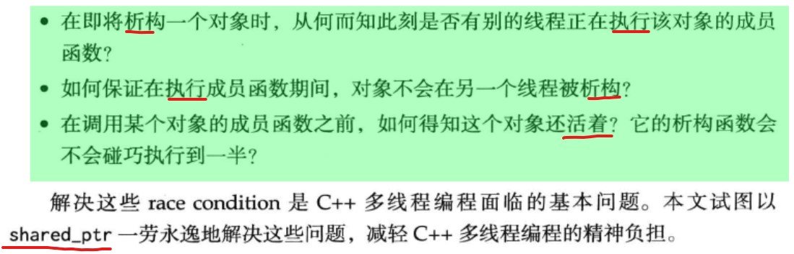
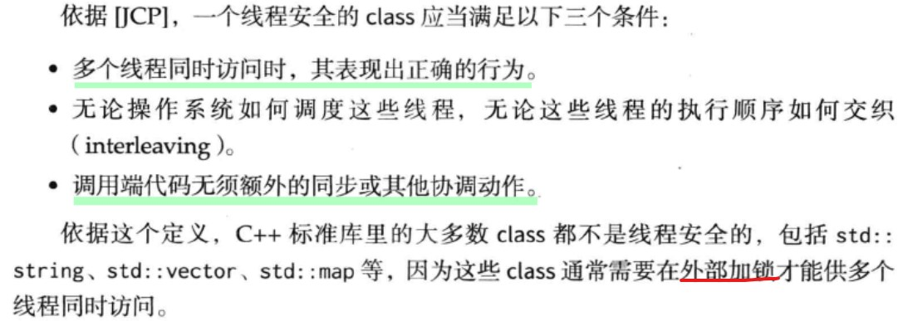
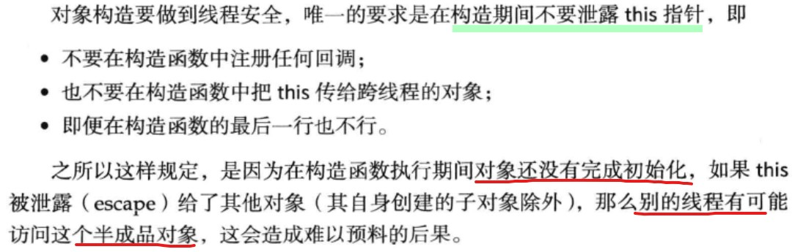
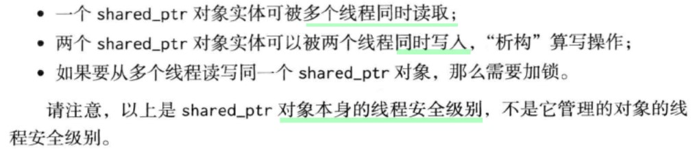
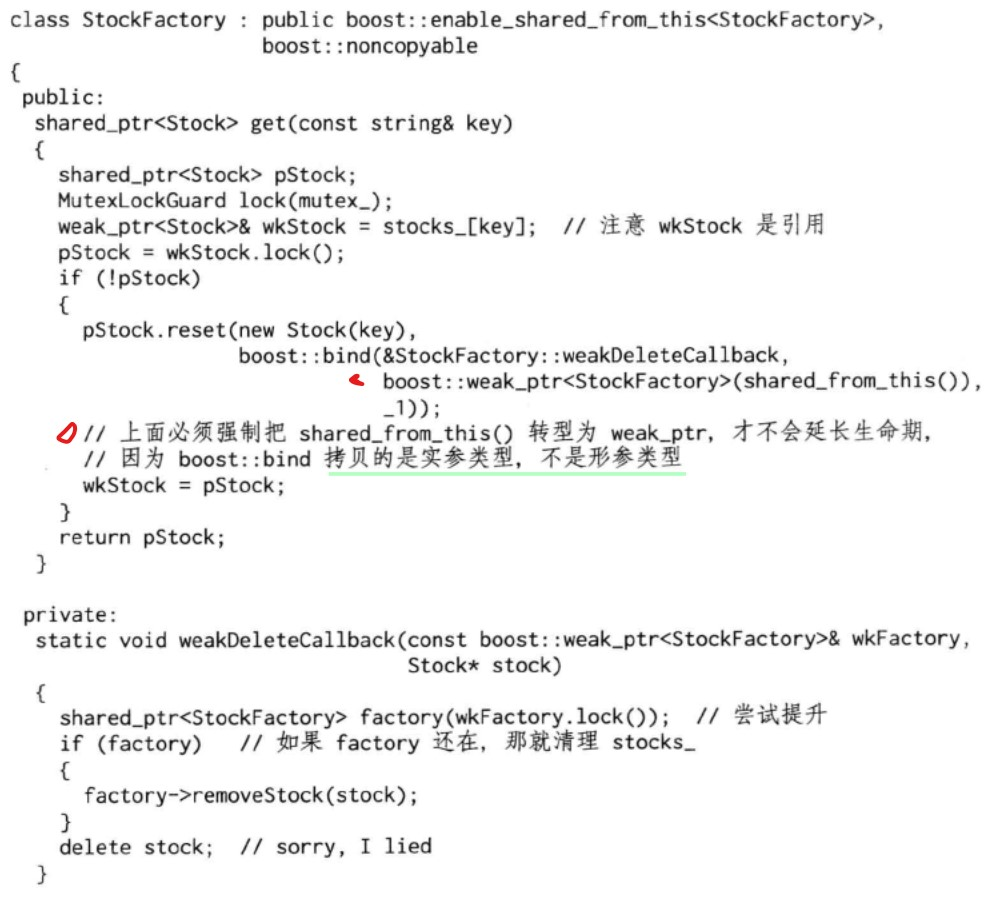

#### CH01 线程安全的对象生命期管理

- 先具备多线程编程经验，熟悉互斥器，竞态条件等概念，了解智能指针，指导Observer设计模式。

  - C++11 [多线程-线程管理](https://www.cnblogs.com/wangguchangqing/p/6134635.html)

  - 每个应用程序至少有一个进程，而每个进程至少有一个主线程，除了主线程外，在一个进程中还可以创建多个线程。每个线程都需要一个入口函数，入口函数返回退出，该线程也会退出，主线程就是以`main`函数作为入口函数的线程。

  - 当线程启动后，**一定要在和线程相关联的thread销毁前，确定以何种方式等待线程执行结束**。C++11有两种方式来等待线程结束

    - detach方式，启动的线程自主在后台运行，当前的代码继续往下执行，不等待新线程结束。前面代码所使用的就是这种方式。
    - join方式，等待启动的线程完成，才会继续往下执行。假如前面的代码使用这种方式，其输出就会0,1,2,3，因为每次都是前一个线程输出完成了才会进行下一个循环，启动下一个新线程。

    无论在何种情形，一定要在`thread`销毁前，调用`t.join`或者`t.detach`，来决定线程以何种方式运行。当使用join方式时，会阻塞当前代码，等待线程完成退出后，才会继续向下执行；而使用detach方式则不会对当前代码造成影响，当前代码继续向下执行，创建的新线程同时并发执行，这时候需要特别注意：**创建的新线程对当前作用域的变量的使用**，创建新线程的作用域结束后，有可能线程仍然在执行，这时局部变量随着作用域的完成都已销毁，如果线程继续使用局部变量的**引用或者指针**，会出现意想不到的错误，**并且这种错误很难排查**。

- ##### 1.1 当析构函数遇到多线程

  - ###### race condition 竞态条件

  - ###### 线程安全的定义
    - 
    
  - MutexLock，封装临界区，用RAII手法封装互斥器的创建与销毁。

  - MutexLockGuard封装临界区的进入和退出，即加锁和解锁。一般是一个栈上对象，他的作用域刚好等于临界区域。  两个都不能被拷贝或者赋值。

  - 1.1.3 一个线程安全的Counter示例 

    - 每个对象都有自己的mutex_，不构成锁争用。

- #####  1.2 对象的创建很简单

  - 
  - 比如，如果Foo是个基类，基类先于派生类构造，Foo里边执行完后还会调用派生类的构造，如果暴露this，派生类对象还处于构造中，不安全。

- #### 1.3 销毁太难

  - 一般成员函数，做到线程安全的方法是让他们顺序执行，不要并发执行，也就是让每个成员函数的临界区不重叠。不过还有个隐含条件，**成员函数用来保护临界区的互斥器本身必须是有效的**。注意析构函数会销毁其mutex成员的。
  - 作为成员的mutex不能保护析构。
    - 成员的生命期最多与对象一样长，而析构动作可说是放生在对象身故之后。
    - 而且基类对象所有的mutex不能保护整个析构过程（派生类的析构函数先调用）。
    - 只有别的线程都访问不到这个对象时，析构才是安全的。
    - **一个函数如果要锁住相同类型的多个对象，为了保证始终按相同的顺序加锁，可以比较mutex对象的地址，始终先加锁地址较小的mutex**。
  
- #### 1.4 线程安全的Observer有多难

  - 如何判断一个动态创建的对象是否还活着？

- #### 1.5 原始指针有何不妥？

  - **空悬指针**，两个指针p1，p2指向同一个堆上的对象，如果释放p1，那么p2就变成了空悬指针。
  - 可以考虑引入一个间接层，让p1和p2所指的对象永久有效。

- #### 1.6 神器shared_ptr和weak_ptr

  - shared_ptr强引用，最后一个shared_ptr析构或者reset时候，它所指的对象保证被销毁。
  - weak_ptr不控制对象的生命期，但是它知道对象是否还活着。如果活着，它可以提升为有效的shared_ptr。如果死了，返回一个空的shared_ptr。**提升或lock操作是线程安全的**

- #### 1.7 系统地避免各种指针错误

  - C++可能出现的内存问题大致有几个方面：
    - 缓冲区溢出
    - 空悬指针或者野指针
    - 重复释放
    - 内存泄露
    - 不配对的new[]/delete
    - 内存碎片
  - 注意shared_ptr和weak_ptr都是值语义的，要么是栈上对象，或是其他对象的直接数据成员，或是标准库容器里的元素。

- #### 1.8 应用到Observer上

  - 思考：如果把48行 vector<weak_ptr<Observer>>改为vector<shared_ptr<Observer>>会有什么后果？
    - 见1.10解释，意外延长对象的生命期。
  - 部分问题
    - 侵入性，强制要求Observer必须以shared_ptr来管理
    - 不是完全线程安全
    - 锁争用
    - 死锁

- #### 1.9　再论shared_ptr的线程安全

  - 
  - 尽可能缩短临界区长度。也尽可能将销毁行为移除临界区。
  - 详细内容看书P36
  
- #### 1.10 shared_ptr技术与陷阱

  - 意外延长对象的生命期。
    - 如在1.8中的思考，除非手动调用unregister函数，否则Observer对象就不会调用其析构函数。
    - 另外一个出错的可能是bind，因为bind会把实参拷贝一份。
  - 函数参数。shared_ptr的拷贝开销比拷贝原始指针要高，但是需要拷贝的时候并不多。通常都是用const &。
  - 析构动作在创建时被捕获。**这是泛型编程和面向对象编程的一次完美结合**。
  - 析构所在的线程。这个线程不一定是对象诞生的线程。我们可以用一个单独的线程来专门做析构。
  - 现成的RAII handle。

- #### 1.11 对象池

  - 问题1，Stock对象永远不会被销毁，因为map中存的是shared_ptr。
  - 改为weak_ptr后，会出现轻微的内存泄露。map中存的是曾经存活过的Stock对象的总数。
  - 可以考虑用shared_ptr的定制析构功能。即当析构shared_ptr时候，也删除map中存放的失效的Stock。
    - 注意我们把一个原始的StockFactory this保存在function里，这里会有线程安全问题。如果工厂类先于Stock析构，那么会core dump。也可以解决，用弱回调。
  - 可以考虑用shared_ptr来解决对象生命期问题。如何获得一个指向当前对象的shared_ptr对象呢？
    - 可以用enable_shared_from_this。这是一个以其派生类为模板类型实参的基类模板，继承它，this指针就能变身为shared_ptr。
    - 注意shared_from_this不能再构造函数中调用，因为在构造工厂类时，它还没有被交给shared_ptr接管。
    - 问题，Stock工厂的生命期被意外延长了。它不短于绑定的function对象
  - 此刻，可以拿出weak_ptr大法。
     		- 
     		- 通常Factory对象是个singleton，在运行期间不会销毁。注意此处实现的弱回调。在MoreEffectiveC++/muduo/CH01_11.cpp
     		- 注意此处的Factory只有针对单个Stock对象的操作，如果需要遍历整个stock_，稍不注意就会造成死锁或者数据损坏，参考2.8的解决办法

