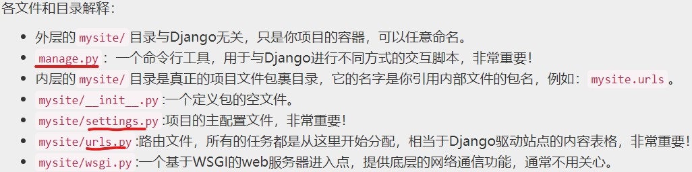
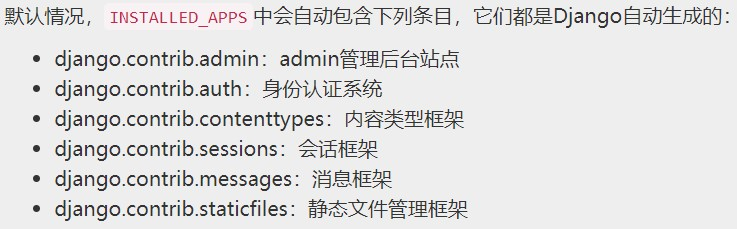

# 第一个Django应用（Django v2.0）

## 环境搭建

由于我Python环境使用的是[Anaconda](https://github.com/pypa/virtualenv/issues/1139)，故系统路径一定要设置好。某些包是在Lib下的，记得配置，比如pip。

## Part01： 请求与响应
- 1. 新建项目
VS中直接新建空的Django项目，可以参考微软官方[文档](https://docs.microsoft.com/zh-cn/visualstudio/python/learn-django-in-visual-studio-step-05-django-authentication?view=vs-2017)。或者
$ django-admin startproject mysite
 

- 2. 启动开发服务器
$ python manage.py runserver
Django提供了一个用于开发的web服务器，使你无需配置一个类似Ngnix的线上服务器，就能让站点运行起来。
Django的开发服务器具有自动重载功能，当你的代码有修改，每隔一段时间服务器将自动更新。

- 3. 创建应用
$ python manage.py startapp polls
VS中也提供GUI操作。

- 4. 编写第一个视图
在polls/views.py中编写视图。为了调用该视图，我们还需要配置相应路由，在polls/urls.py中更改。
接下来，需要在主urls中添加urlpattern条目。
此处作者给出url的参数解释。

## Part02： 模型与后台管理
- 1. 数据库安装
先暂时使用默认的SQlite。可在settings中修改。
 

- 2. 创建模型
Django通过自定义Python类的形式来定义具体的模型，每个模型的物理存在方式就是一个Python的类Class，每个模型代表数据库中的一张表，每个类的实例代表数据表中的一行数据，类中的每个变量代表数据表中的一列字段。Django通过模型，将Python代码和数据库操作结合起来，实现对SQL查询语言的封装。也就是说，你可以不会管理数据库，可以不会SQL语言，你同样能通过Python的代码进行数据库的操作。Django通过ORM对数据库进行操作，奉行代码优先的理念，将Python程序员和数据库管理员进行分工解耦。

- 3. 启用模型
创建模型，Django会做两件事：创建该app对应的数据库表结构；为Question和Choice对象创建基于Python的数据库访问API。
将polls加入INSTALLED_APPS（# mysite/settings.py）。
$ python manage.py makemigrations polls
通过运行makemigrations命令，相当于告诉Django你对模型有改动，并且你想把这些改动保存为一个“迁移(migration)”。（migrations是Django保存模型修改记录的文件，这些文件保存在磁盘上。在例子中，它就是polls/migrations/0001_initial.py，你可以打开它看看，里面保存的都是人类可读并且可编辑的内容，方便你随时手动修改。）
接下来有一个叫做migrate的命令将对数据库执行真正的迁移动作。$ python manage.py migrate

- 4. 使用模型的API
尝试使用Django提供的数据库访问API，可以进入Python的shell，输入$ python manage.py shell。
大概命令如下：
	Question.objects.all()；注意查看廖雪峰老师定制类，可以实现类的自定义输出。
	save方法。
	Question.objects.filter(id=1)
	Question.objects.filter(question_text__startswith='What')
	Question.objects.get(pub_date__year=current_year)
	Question.objects.get(pk=1)，pk代表主键
	q = Question.objects.get(pk=1)；q.choice_set.create(choice_text='Not much', votes=0)
	API会自动进行连表操作，通过双下划线分割关系对象。连表操作可以无限多级，一层一层的连接。
	核心部分，详细信息看教程。

- 5. admin后台管理站点
	- 1. 创建管理员用户
		$ python manage.py createsuperuser
	- 2. 启动开发服务器。
		访问admin/，为了站点的安全，修改其中admin.site.urls对应的正则表达式
	- 3. 进入admin站点
		当前只有两个可编辑的内容：groups和users。它们是django.contrib.auth模块提供的身份认证框架。
	- 4. 在admin中注册投票应用
		在polls/admin.py文件，加入admin.site.register(Question)

## Part03： 视图和模板
- 概述
	问卷“index”页：显示最新的一些问卷
	问卷“detail”页面：显示一个问卷的详细文本内容，没有调查结果但是有一个投票或调查表单。
	问卷“results”页面：显示某个问卷的投票或调查结果。
	投票动作页面：处理针对某个问卷的某个选项的投票动作。
	在Django中，网页和其它的一些内容都是通过视图来处理的。视图其实就是一个简单的Python函数（在基于类的视图中称为方法）。Django通过对比请求的URL地址来选择对应的视图。
	
- 编写视图
	在polls/views.py编写。然后，在polls/urls.py文件中加入url模式，添加刚才编写的视图。
	
	当有人访问/polls/34/地址时，Django将首先加载mysite.urls模块，因为它是settings文件里设置的根URL配置文件。
	在该文件里，Django发现了urlpatterns变量，于是在其内按顺序进行匹配。当它匹配上了^polls/，就裁去url中匹配的文本polls/，然后将剩下的文本“34/”，传递给polls.urls进行下一步的处理。
	在polls.urls中，又匹配到了r’^(?P<question_id>[0-9]+)/$’，最终结果就是调用该模式对应的detail()视图，也就是下面的函数：detail(request=<HttpRequest object>, question_id='34')。
	函数中的question_id=’34’参数，是由(?P<question_id>[0-9]+)而来。在正则表达式中通过一个双圆括号，Django会捕获它匹配到的值并传递给对应的视图，作为视图的位置参数之一，而?P<question_id>则表示我要给这个捕获的值指定一个特殊的变量名，在视图中可以通过question_id这个变量名随意的引用它，形成一个关键字参数，不用考虑参数的位置。至于[0-9]+则是一个很简单的原生正则表达式，用于匹配一系列连续的数字，它匹配到的值也就是具体要传递的参数值。

- 编写能实际干活的视图
	每个视图至少做两件事之一：返回一个包含请求页面的HttpResponse对象或者弹出一个类似Http404的异常。
	这里有个非常重要的问题：在当前视图中的HTML页面是硬编码的。如果你想改变页面的显示内容，就必须修改这里的Python代码。为了解决这个问题，需要使用Django提供的模板系统，解耦视图和模板之间的硬连接。
	render()函数的第一个位置参数是请求对象（就是view函数的第一个参数），第二个位置参数是模板。还可以有一个可选的第三参数，一个字典，包含需要传递给模板的数据。最后render函数返回一个经过字典数据渲染过的模板封装而成的HttpResponse对象。
	
- 返回404错误
	和render一样，也需要从Django内置的快捷方式模块中导出get_object_or_404()
- 使用模板系统
	在例子{{ question.question_text }}中，DJango首先会在question对象中尝试查找一个字典，如果失败，则尝试查找属性，如果再失败，则尝试作为列表的索引进行查询。
-  删除模板中硬编码的URLs
	<li><a href="/polls/{{ question.id }}/">{{ question.question_text }}</a></li>
	它对于代码修改非常不利。设想如果你在urls.py文件里修改了正则表达式，那么你所有的模板中对这个url的引用都需要修改，这是无法接受的！
	更改为：
	<li><a href="">{{ question.question_text }}</a></li>
	
- URL names的命名空间
	在polls/urls.py文件的开头部分，添加一个app_name的变量来指定该应用的命名空间
	修改上边的代码
	<li><a href="">{{ question.question_text }}</a></li>
	注意，**引用方法是冒号而不是圆点也不是斜杠！！！！！！！！！！！！**
	
## Part04 表单和类视图
- 表单form
	上面的模板显示一系列单选按钮，按钮的值是选项的ID，按钮的名字是字符串"choice"。这意味着，当你选择了其中某个按钮，并提交表单，一个包含数据choice=#的POST请求将被发送到指定的url，#是被选择的选项的ID。这就是HTML表单的基本概念。
	forloop.counter是DJango模板系统专门提供的一个变量，用来表示你当前循环的次数，一般用来给循环项目添加有序数标。
	request.POST是一个类似字典的对象，允许你通过键名访问提交的数据。本例中，request.POST[’choice’]返回被选择选项的ID，并且值的类型永远是string字符串，那怕它看起来像数字！同样的，你也可以用类似的手段获取GET请求发送过来的数据，一个道理。
	在选择计数器加一后，返回的是一个HttpResponseRedirect而不是先前我们常用的HttpResponse。HttpResponseRedirect需要一个参数：重定向的URL。这里有一个建议，当你成功处理POST数据后，应当保持一个良好的习惯，始终返回一个HttpResponseRedirect。这不仅仅是对Django而言，它是一个良好的WEB开发习惯。
	我们在上面HttpResponseRedirect的构造器中使用了一个reverse()函数。它能帮助我们避免在视图函数中硬编码URL。它首先需要一个我们在URLconf中指定的name，然后是传递的数据。例如'/polls/3/results/'，其中的3是某个question.id的值。重定向后将进入polls:results对应的视图，并将question.id传递给它。白话来讲，就是把活扔给另外一个路由对应的视图去干。
- 使用类视图：减少重复代码