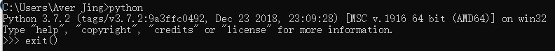

## 1_1 [第一个Python程序](https://www.liaoxuefeng.com/wiki/0014316089557264a6b348958f449949df42a6d3a2e542c000/001431611988455689d4c116b2c4ed6aec000776c00ed52000)

- 命令行模式

  在Windows下通过cmd进入命令行模式，在命令行中敲入Python（需要提前安装好Python），进入Python交互模式，它的提示符是>>>。
  
  注意，输出时不要混用单引号和双引号
  
 - 命令行模式和Python交互模式
	 	区别：
	 	交互模式是输入一行，执行一行，而命令行模式直接运行py文件的所有代码。交互模式主要是为了调试Python代码。
	
 - 输入和输出
