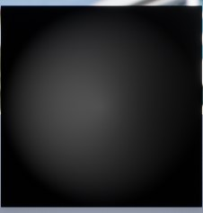
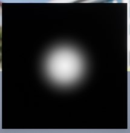
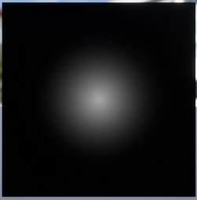

#### 关于Fireworks项目的分析

##### 材质 [文档](http://api.unrealengine.com/CHN/Engine/Rendering/Materials/HowTo/index.html)（内容超赞）

- Particle Color [文档](http://api.unrealengine.com/CHN/Engine/Rendering/Materials/ExpressionReference/Constant/index.html#particlecolor)

  - 依次输出RGB，R，G，B，A

- Time节点用来向材质添加经历时间 [文档](http://api.unrealengine.com/CHN/Engine/Rendering/Materials/ExpressionReference/Constant/index.html#time)

- Noise [文档](http://api.unrealengine.com/CHN/Engine/Rendering/Materials/ExpressionReference/Utility/index.html#noise)

  - 表达式建立过程式噪点场，以使您能够控制其生成方式。

- LinearSine [文档](https://docs.unrealengine.com/en-us/Engine/Rendering/Materials/Functions/Reference/Math)

  - 可以选择周期性返回一个0到1的数（可以选择为-1到1）

- **粒子相对时间（ParticleRelativeTime）** 表达式输出0到1之间的数字，表示粒子的年龄，0表示出生时刻，1表示死亡时刻。

- ##### M_TS_FireworkSmoke的实现

  - 实现根据材质RadicalGradient（虚幻引擎自带的）
    - 利用球体蒙板(SphereMask)实现的（[文档](http://api.unrealengine.com/CHN/Engine/Rendering/Materials/ExpressionReference/Utility/index.html)），
    - 输入A、B；A代表要检查的点的位置，B代表球体的中心，Raidus代表半径。
    - 在球体外蒙版值为0，在球体内蒙版值为1
    - **此处利用这个特性，作为透明度**
    
  - 和PaticleColor中的透明度相乘，注意alpha的值：0.0代表完全透明，1.0代表不透明。

  - 上一步得到的值在和Noise（[文档](http://api.unrealengine.com/CHN/Engine/Rendering/Materials/ExpressionReference/Utility/index.html#noise)）中得到的值相乘

  - 最后在和0.15相乘，为了降低透明度。得到一个透明度如下的效果：

    

- ##### M_TS_FireworkSimple的实现

  - 就M_TS_FireworkSmoke和M_TS_FireworkSimple比较，在粒子发射器中，M_TS_FireworkSmoke很暗，M_TS_FireworkSimple比较亮。

  - 这部分关于3个LinearSine的不知道为什么这么用，不知道原理。如果不使用的话，效果这样

    

  - 原作者的效果：

    

- 使用主材质节点 [文档](http://api.unrealengine.com/CHN/Engine/Rendering/Materials/HowTo/Main_Material_Node/index.html)

- #### 什么是材质实例？ [文档](http://api.unrealengine.com/CHN/Resources/ContentExamples/MaterialInstances/1_2/index.html)

  - 材质实例是材质的子项，这意味着它拥有父材质所拥有的一切，但是每个参数都可以在材质实例上单独更改。
  - 好处：
    - 复用，可以拿着某种材质做一个材质实例
    - 速度，更改材质实例的参数是即时性的，因为着色器已经编译好了。

- #### 创建和使用材质实例 [文档](http://api.unrealengine.com/CHN/Engine/Rendering/Materials/HowTo/Instancing/index.html)

  - 材质参数
    - 将节点添加到或者转换为参数节点
  - 创建材质实例
    - 先创建一个新材质（父类）
    - 在该材质上创建材质实例

- #### 材质属性 [文档](http://api.unrealengine.com/CHN/Engine/Rendering/Materials/MaterialProperties/index.html)

  - 物理材质

    - 物理材质（Physical Material）提供了物理属性的定义，例如碰撞（弹力）以及其他基于物理的方面会保留多少能量。**物理材质（Physical Material）对材质的外观没有影响**。

  - ##### 材质（这部分很重要，看文档）

    - **材质域（Material Domain）**

      - 此设置允许您指定如何使用此材质。某些材质的使用（例如贴花）需要额外的说明，以便渲染引擎加以考虑。
	- **混合模式**
  
    	- 不透明，遮罩，半透明，添加，调制。
  - **着色模型（Shading Model）**
    
      - 着色模型决定了材质输入(如自发光，漫射，镜面反射，法线)如何组合以形成最终颜色。
      - 一般采用**默认光照**。
  
- #### 使用透明度 [文档](http://api.unrealengine.com/CHN/Engine/Rendering/Materials/HowTo/Transparency/index.html)

  - 在材质属性Blend Mode中选择Translucent
  - **透明度与反射**
    - 设置下列选项后，使用了透明度的对象可以显示场景反射。 但是，请记住，启用大量具有反射的半透明材质可能会引起性能问题
    - 在 **细节（Details）**面板的 **半透明（Translucency）**部分中，将 **半透明照明模式（Translucent Light Mode）**从 **体积无方向（Volumetric Non Directional** 更改为 **表面透明度体积（Surface TranslucencyVolume）**。
  - 透明度可用来模拟各种不同的现实世界表面类型，比如头发，玻璃，水，烟雾或者火焰，云，贴纸，植物叶子等。
  - **半透明优先顺序**
    - 虽然调整 **半透明优先顺序（Translucency Sort Priority）**可以修正关卡中的顺序问题，但可能会在游戏期间产生效果或对象时引入新的顺序问题。 因此，最好定义要使用的 **半透明优先顺序（Translucency Sort Priority）**数值以及使用位置。 例如，您可以指定产生的所有效果的 **半透明优先顺序（Translucency Sort Priority）**均为 100。 因此，如果关卡中存在一些顺序问题，您可将关卡中对象的 **半透明优先顺序（Translucency Sort Priority）**调整为任何不大于 99 的数值。 这样，产生的游戏效果将始终在所有其他对象前面渲染，而无论关卡中这些对象的 **半透明优先顺序（Translucency Sort Priority）**为何。

#### 粒子 [文档](http://api.unrealengine.com/CHN/Engine/Rendering/ParticleSystems/Reference/index.html)

- 粒子系统用户指南 [文档](http://api.unrealengine.com/CHN/Engine/Rendering/ParticleSystems/UserGuide/index.html)
  - 该文档涵盖粒子系统和粒子系统编辑器级联的常规使用工作流。
  - 创建粒子系统
  - 编辑粒子系统
  - 添加发射器
  - 编辑发射器
  - 发射器排序，使用左右方向键
  - 添加模块，模块会对**粒子生成位置，运动方式，色彩以及其他诸多属性**产生影响。在粒子发射器上右键即可添加这些属性。
  - 编辑模块，Details面板显示当前选中的发射器或模块的属性。
  - **Distributions**用于调整粒子在生命周期的数值。Distributions是一组灵活的数据类型，包括固定值，一段范围内的随机值，沿曲线内插的值，以及参数所驱动的值。[文档](http://api.unrealengine.com/CHN/Engine/Basics/Distributions/index.html)
  - 曲线，利用Curve Editor可将Distributions可视化为曲线，特定模块的曲线可点击模块上的微型图标访问。
  - 类型类型，专门用于对粒子发射器的外观和功能进行重大改变。
  - 细节级别(LOD)快速设置
- Require模块(仅列举部分，全部参考[文档](http://api.unrealengine.com/CHN/Engine/Rendering/ParticleSystems/Reference/Modules/Required/index.html))
  - Emitter
    - **材质**；屏幕对齐(粒子相对于摄像头的朝向)
  - Duration，持续时间
    - 可以调整**发射器持续时间**，以及**发射器循环多少次**
  - Delay，延迟
    - 可以调整发射器延迟（下次循环时隔多久再次启动）
  - Rendering，渲染
    - 可以设定最大粒子绘制数量。
- Spawn模块
  - Spawn，产生
    - Rate，速度，控制发射器粒子产生速度。
    - Rate Scale，速度比例。最终速度应该是速度和速度比例的乘积。
  - Burst，爆发
    - 粒子爆发方法
    - 爆发列表，可以调整发射器在给定时间在范围内的粒子数量。
    - 爆发比例，按照这个比例调整所有爆发条目。
- Location模块 [文档](http://api.unrealengine.com/CHN/Engine/Rendering/ParticleSystems/Reference/Modules/Location/index.html)
  - Emitter Init Loc，将粒子的初始位置设为来自另一个发射器的粒子位置（在同一个粒子系统中）
    - Emmiter Name，设置来自的那个发射器的名字，用于位置粒子的原点。
    - Selection Method，一种是Random，随机选择一个粒子。另一种是Sequence，从源发射器按顺序依次通过每个粒子。
    - **Inherit Source Velocity Scale**，继承时源速度的调整量。
    - **Inherit Source Rotation Scale**，继承时源旋转的调整量。
- Size模块 [文档](http://api.unrealengine.com/CHN/Engine/Rendering/ParticleSystems/Reference/Modules/Size/index.html)
  - **Initial Size** 模块用于设置粒子生成时的初始尺寸。
  - 疑问？size是怎么调整的？为什么是vector？有时候仅仅x有用，有时候全部都有用！
- Lifetime模块 [文档](http://api.unrealengine.com/CHN/Engine/Rendering/ParticleSystems/Reference/Modules/Lifetime/index.html)
  - 用于粒子生成时设置其初始生命周期。
- Color模块 [文档](http://api.unrealengine.com/CHN/Engine/Rendering/ParticleSystems/Reference/Modules/Color/index.html)
  - 通过Distribution设置颜色，此处我测试用Distribution Vector Constant Curve实现三种颜色的渐变，根据时间点不同设置不同的颜色。
- Acceleration模块 [文档](http://api.unrealengine.com/CHN/Engine/Rendering/ParticleSystems/Reference/Modules/Acceleration/index.html)
  - 该模块用于在粒子上应用加速度，或随时间变化改变粒子的速度。
  - const acceleration
  - Drag，为每个粒子的运动应用产生恒定阻力。
- Event事件模块 [文档](http://api.unrealengine.com/CHN/Engine/Rendering/ParticleSystems/Reference/Modules/Event/index.html)
  - **事件模块允许您基于粒子自身间、不同粒子之间、或者粒子和世界之间的相互作用来产生事件，然后监听这些事件并在一个交互的粒子系统关卡中导致一系列的反应**。 一个很好的例子是当一个粒子和世界中其它物体产生碰撞时，会触发指定的碰撞事件，然后在那些碰撞发生的地方产生粒子。
  - 

#### 蓝图

- **关卡蓝图** [文档](http://api.unrealengine.com/CHN/Engine/Blueprints/UserGuide/Types/LevelBlueprint/index.html)
  - **关卡蓝图（Level Blueprint）** 是一种专业类型的 **蓝图（Blueprint）**，用作关卡范围的全局事件图。 在默认情况下，项目中的每个关卡都创建了自己的关卡蓝图，您可以在虚幻编辑器中编辑这些关卡蓝图， 但是不能通过编辑器接口创建新的关卡蓝图。
  - 在Firework中设置按键触发事件

#### Skeleton mesh

- 创建骨架资源 [文档](http://api.unrealengine.com/CHN/Engine/Animation/Skeleton/index.html)
  - 创建骨架资源的主要方式在骨架网格体的[导入](http://api.unrealengine.com/CHN/Engine/Content/ImportingContent/ImportingSkeletalMeshes/index.html) 中发生。 导入骨架网格体时，**如将[FBX导入选项](https://docs.unrealengine.com/latest/INT/Engine/Content/FBX/ImportOptions/?lang=ko#skeletalmeshoptions) 窗口中的 骨架（Skeleton）域留空，则基于正在导入的骨架网格体自动创建一个骨架资源**。

#### 烟花初始

- 首先在ContentBrowser中选择创建一个粒子系统。
- 爆炸效果
  - 在选择Required中选择Emitter，找到Material，更改默认的材质，找到Fireworks_Solid（是一个材质实例，父材质是Fireworks_Simple，上边有它的原理解释）。
    - Duration中更改EmitterLoops设置为1
  - Spawn模块中，设置Burst，为了在给定时间爆发“计数”数量的粒子，详情看[文档](http://api.unrealengine.com/CHN/Engine/Rendering/ParticleSystems/Reference/Modules/Required/index.html)。
    - Rate中设置为0，产生粒子的数量由BurstList控制。
    - Burst List添加一个数组元素
      - 元素0中count设置为150.
  - Location中，添加Sphere，为了模仿烟花的爆炸。
    - 在Start Radius设置半径，120吧。可以根据效果调整。
  - Initial Velocity中设置
    - Start Velocity Radial，为500.确定粒子沿径向应用的速度。
- 尾巴效果
  - 创建一个GPU粒子，CPU渲染的更细节。
  - Required
    - 更改材质
    - **还要更改Screen Alignment**，改为PSA_Velocity。原理不知道。实际效果把粒子拉长了。
    - 更改Duration
  - Spawn中更改Rate，5000
  - Lifetime设置min，max生命时间
  - Initial Velocity，速度设置在-250到250之间
  - const Acceleration，设置z为-900，使粒子向下边运动。
  - 设置Drag属性。

#### 字体特效尝试 [教程](https://www.youtube.com/watch?v=akzW2htA1Hs)

- 此处使用材质的Masked[混合模式](http://api.unrealengine.com/CHN/Engine/Rendering/Materials/MaterialProperties/index.html)，通过参数调整Opacity Mask，使之能够使字体从有到无。


##### 如何使用C++代码设置粒子系统

- [论坛](https://answers.unrealengine.com/questions/33643/attach-particle-system-through-code.html)

- 方法1：
  - ``` c++
	  class UParticleSystemComponent* ParticleEmmitter;
	  ParticleEmmitter = CreateDefaultSubobject<UParticleSystemComponent>(TEXT("ParticleEmitter"));
	  	ConstructorHelpers::FObjectFinder<UParticleSystem> ReferenceVariable(TEXT("'/Game/TS_Fireworks/Particles/CustomText'"));
	  	if (ReferenceVariable.Succeeded()) {
	  		ParticleEmmitter->SetTemplate(ReferenceVariable.Object);
    		//UE_LOG(YourLog, Warning, TEXT("exec ReferenceVariable"));
    	}
    ```
  
- 方法二

  - ``` c++
  	class UParticleSystem* ParticleSystem;
  	auto owner = GetOwner();
    	if (ParticleSystem) {
    		UGameplayStatics::SpawnEmitterAtLocation(this, ParticleSystem, owner->GetActorLocation(), owner->GetActorRotation());
    	}
    ```
  
- C++中的方法应该有和蓝图中的对应方法。

