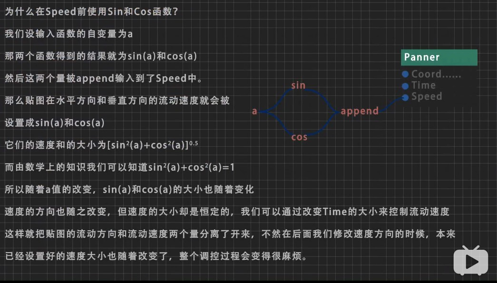
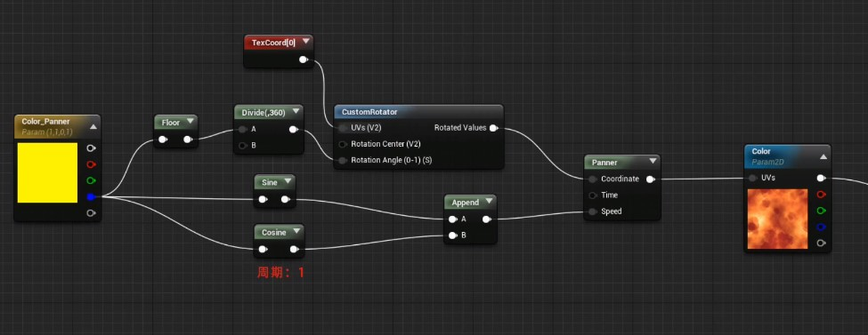
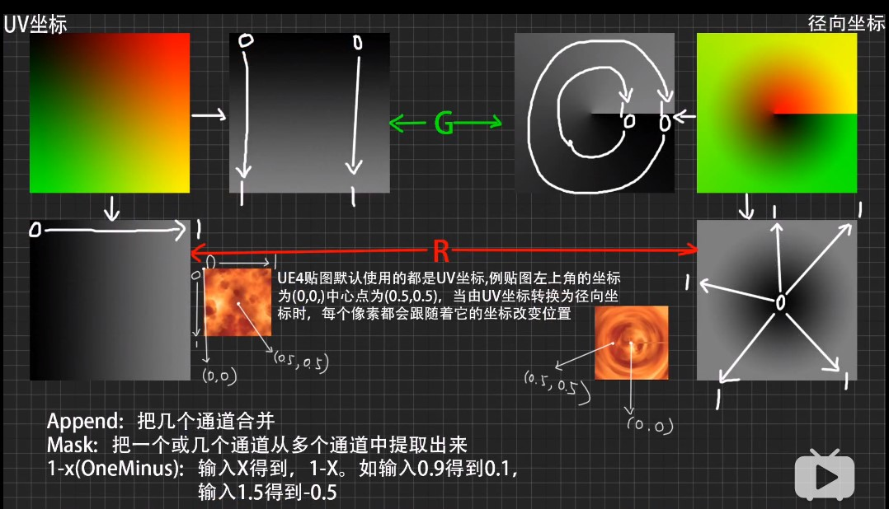
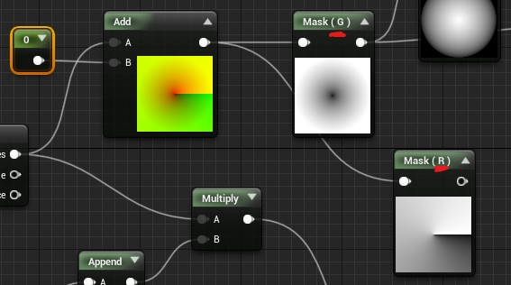
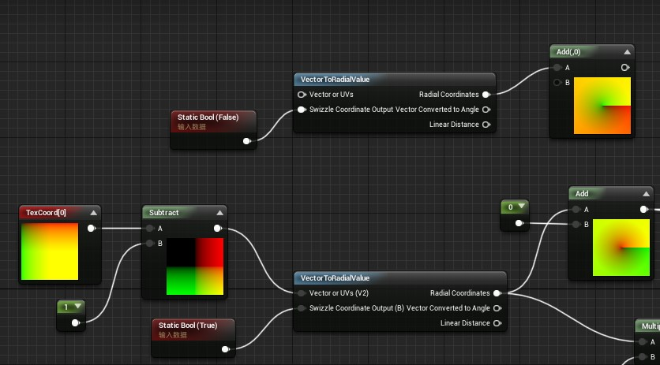

## 材质部分

#### 烟火部分也涉及到材质

- 请翻阅 firework.md

#### 材质教程 [链接](https://space.bilibili.com/5660448/video)

##### 1

- 关于材质的基本信息，参考烟火部分的文档（官方文档）。
- 按住P键，再点击鼠标左键，建立Panner（输出纹理坐标，可以用来生成移动的纹理）。
  - 再Panner中 Speed X为正时，贴图向左移动；Y为正时贴图向上流动。反之亦然。两者相互影响。通过一个二维向量当作输入speed可达到同样效果。
  - 
- 按住U，再点击鼠标左键，建立一张纹理坐标。
- 用**CustomRotator**调节纹理的旋转。

##### [2](https://www.bilibili.com/video/av42345350)

- 小技巧，如何用蓝通道控制两个量
  - 
  - 虚幻中sin和cos周期为1. **用蓝通道的整数值控制旋转，小数部分控制运动方向。**
- 透明度，1完全不透明，0完全透明。
- Refraction，这是控制透明贴图折射程度的一个数据。输入1的时候没有任何效果，越偏离1折射效果越好。折射在特效中经常使用，常见于各种爆炸以及刀光。
- **VectorToRadialValue**，生成一个径向的纹理坐标
  - 
  - 
  - 注意G通道中坐标应该是对应极坐标的半径，而R通道对应角度。上上边的图，感觉有点小问题。
- 
  - 关于对纹理坐标使用subtract。
    - 图中显示为**分割了四个颜色块**。注意途中的右下角纹理坐标是2.0，2.0
    - 减法是每个通道的值都减去减法中提供的B值
  - **还要注意 true和false对径向坐标的影响**
    - 设置true是一个向中心点收缩
    - false则是围着中心点旋转。

##### [3](https://www.bilibili.com/video/av43416898)

- 材质函数
  - 按住F，点击鼠标左键，使用材质函数。
  - 相当于C++的函数，把一些重复性的东西放在函数中。
  - input输入，可以是常量，二维，三维等等。**如果有预设值，记得勾选use Preview value。**
- 粒子系统和材质交互
  - Particle color；dynamic parameter。详情请看，helloworld项目中的，fire材质。
  - **使用Distribution Float Constant Curve**，in val 0.0代表当粒子出生时候，out val输出多少；当in val为1.0时，代表粒子死亡时候，out val输出多少。

##### [4](https://www.bilibili.com/video/av44168972)

- 

