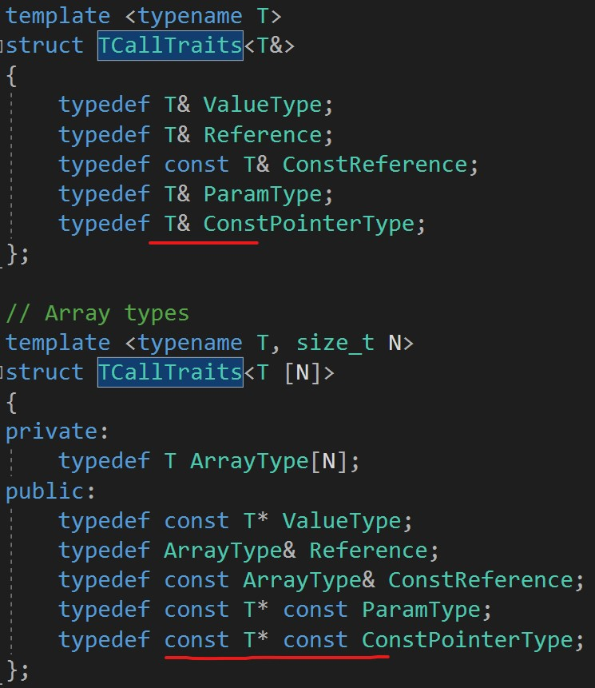

### 记录在阅读UE源码过程中遇到的知识点
> 环境：UE4_22

- ```c++
       	enum { PassByValue = TOr<TAndValue<(sizeof(T) <= sizeof(void*)), TIsPODType<T>>, TIsArithmetic<T>, TIsPointer<T>>::Value };
//判断参数是否是值传递；先判断T的字节数是否小于等于指针（应该是一种简单优化），再判断是否是POD；接下来是数值以及指针类型判断
   ```

- 疑问，关于Traits当中的const类型，什么时候应该加const，什么时候不加

    - 

- 关于标准库move再虚幻中的实现

    - 如果参数是**引用或者是const &**则编译会报错。因为move并没有起到左右。
    - 否则则转化为右值。

- 侵入式智能指针和非侵入式智能指针 [区别](https://blog.csdn.net/jiange_zh/article/details/52512337)

    - TSharedPtr是一种**非侵入式**引用计数指针，它提供了线程安全的模式，需要设置。
    - 侵入式智能指针的引用计数保存在对象里，因为对象是唯一的，所以引用计数也是唯一的。