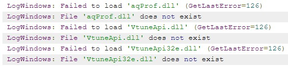

##### 编辑器基本快捷操作

- 鼠标右键调整摄像机视角，左键位移，Q和E垂直上下位移，WASD略。F聚焦某个物体，此时ALT+鼠标左键可以360°观察物体。END键将物体落地。

##### 虚幻项目目录结构([来源](https://zhuanlan.zhihu.com/p/22814098))

- Binaries,存放编译生成的结果二进制文件.该目录可以gitignore,反正每次都会生成。
- Config,配置文件
- Content,最常用到, 所有的资源和蓝图等都放在该目录下
- DerivedDataCache：“DDC”，存储着引擎针对平台特化后的资源版本。比如同一个图片，针对不同的平台有不同的适合格式，这个时候就可以在不动原始的uasset的基础上，比较轻易的再生成不同格式资源版本。gitignore。
- Intermediate：中间文件（gitignore），存放着一些临时生成的文件。有：
  - Build的中间文件，.obj和预编译头等
  - UHT预处理生成的.generated.h/.cpp文件
  - VS.vcxproj项目文件，可通过.uproject文件生成编译生成的Shader文件。
  - AssetRegistryCache：Asset Registry系统的缓存文件，Asset Registry可以简单理解为一个索引了所有uasset资源头信息的注册表。CachedAssetRegistry.bin文件也是如此。
- Saved：存储自动保存文件，其他配置文件，日志文件，引擎崩溃日志，硬件信息，烘培信息数据等。gitignore
- Source：代码文件。

##### 虚幻4的命名规则([官方文档](http://api.unrealengine.com/CHN/Programming/Development/CodingStandard/))

- 命名规则:

  - 注意类名有额外的大写字母前缀,如FSkin是一个类,而Skin是该类的实例化

  - 模版类以T作为前缀，比如TArray,TMap,TSet UObject派生类都以U前缀

  - AActor派生类都以A前缀

  - SWidget派生类都以S前缀

  - 抽象接口以I前缀

  - 枚举以E开头

  - bool变量以b前缀，如bPendingDestruction

  - 其他的大部分以F开头，如FString,FName

  - typedef的以原型名前缀为准，如typedef TArray<FMyType> FArrayOfMyTypes;

  - 在编辑器里和C#里，类型名是去掉前缀过的

  - UHT在工作的时候需要你提供正确的前缀，所以虽然说是约定，但你也得必须遵守。（编译系统怎么用到那些前缀，后续再讨论）

  - ###### 函数命名用动词,如果有返回值名字要清晰知道返回值的含义.

- 现代C++语法

  - static_assert,override,final,nullptr
  - 不建议使用auto,除非在必须的情况,如:
  - 推断lambda变量类型
  	- 迭代器类型过于冗长,降低可读性的时候
  	- 模板代码中,类型表达式无法清楚表达时候
  - 范围for
  - lambda和匿名函数
    - 长度最好不要超过两条语句
    - 对于大型匿名函数或者延迟执行来说,倾向使用显示捕获.倾向使用显式返回类型.
  - 强类型的enum class,解释看[这里](https://blog.csdn.net/sanoseiichirou/article/details/50180533)
    - 原来的enum问题: 向整性的隐式转换
    - 无法指定底层所使用的数据类型
    - enum的作用域,**大括号并没有将枚举成员的可见域限制在大括号内，导致enum成员曝露到了上一级作用域(块语句)中。** 可以利用命名空间解决.
  - 移动语义
  - 默认成员初始化
    - 需要重新编译依赖文件才能修改默认设置。
    - 引擎的补丁中无法修改标头，此格式将限制修复的类型。
    - 无法以此方式初始化所有对象，例如基类、UObject子对象、前置声明类型的指针、构造函数参数的推断值、多步骤初始化成员等。
    - 标头中含有一些初始器，其余则在.cpp文件的构造函数中，可能会影响可读性和可维护性。

##### 基础概念

- 在UE4中，几乎所有的对象都继承于UObject（跟Java,C#一样），UObject为它们提供了基础的垃圾回收，反射，元数据，序列化等，相应的，就有各种"UClass"的派生们定义了属性和行为的数据。
- 在UE中，3D世界是由Actors构建起来的，而Actor又拥有各种Component，之后又有各种Controller可以控制Actor（Pawn）的行为。在UE4中，你也可以为一个Actor添加一个蓝图或者C++ Component,然后实现它来直接组织逻辑。 UE4也支持各种插件。

##### 编译系统

UE4支持众多平台，包括Windows,IOS，Android等，因此UE4为了方便你配置各个平台的参数和编译选项，简化编译流程,UE4实现了自己的一套**编译系统**，否则我们就得接受各个平台再单独配置一套项目之苦了。
这套工具的编译流程结果，简单来说，就是你在VS里的运行，背后会运行UE4的一些命令行工具来完成编译，其他最重要的两个组件：

- UnrealBuildTool（UBT，C#）：UE4的自定义工具，来编译UE4的逐个模块并处理依赖等。我们编写的Target.cs，Build.cs都是为这个工具服务的。
- UnrealHeaderTool （UHT，C++）：UE4的C++代码解析生成工具，我们在代码里写的那些宏UCLASS等和#include "*.generated.h"都为UHT提供了信息来生成相应的C++反射代码。

一般来说，UBT会先调用UHT会先负责解析一遍C++代码，生成相应其他代码。然后开始调用平台特定的编译工具(VisualStudio,LLVM)来编译各个模块。最后启动Editor或者是Game.

##### UE4术语(文档[链接](http://api.unrealengine.com/CHN/GettingStarted/Terminology/))

- Project项目 
  - 一个项目会经常被与其关联的`.uproject`文件所引用，但它们是两个互相并存的独立文件。`.uproject`是一个用于创建、打开或保存文件的参考文件，而项目则包含与其关联的所有文件和文件夹。
- Object对象
  - 在虚幻引擎中，最基础的构建单元叫做 **Object**，它包含了很多游戏资源必需的 **幕后** 功能。虚幻引擎4中几乎所有的东西都是继承自Object（或从中获取部分功能）。在C++中，`UObject` 是所有Object的基类，实现了诸如垃圾回收、开放变量给编辑器的元数据（UProperty），以及存盘和读盘时的序列化功能。
- Class类
  - **类（Class）** 用于定义在创建虚幻引擎游戏中使用的特定Actor或对象的行为和属性。类具有层级性，这意味着某个类从其父类（衍生或派生出该类的类）获得信息，然后再将信息传递给子项。类可用C++代码或蓝图创建。
- Actors
  - 可放入关卡中的对象都是 **Actor**。Actor是支持三维转换（如平移、旋转和缩放）的泛型类。可通过游戏进程代码（C++或蓝图）创建（生成）及销毁Actor。在C++中，AActor是所有Actor的基本类。
- Component组件
  - **组件（Component）** 是可添加到Actor的一项功能。组件不可独立存在，但在将其添加到Actor后，该Actor便可以访问并可以使用该组件所提供的功能。
- Pawn人形体
  - **Pawn** 是Actor的一个子类，充当游戏中的化身或假面，例如游戏中的角色。Pawn可以由玩家或游戏AI以非玩家角色（NPC）的形式控制。
- **Character 角色**
  - **角色（Character）** 是Pawn Actor的子类，旨在用作玩家角色。角色子类包括碰撞设置、双足运动的输入绑定，以及由玩家控制的运动附加代码。
- **PlayerController 玩家控制器**
  - **玩家控制器（PlayerController）** 类用于在游戏中获取玩家输入并将其转换为交互，每个游戏中至少有一个玩家控制器。玩家控制器通常拥有一个Pawn或角色作为游戏中玩家的代表。
- Level关卡
  - **level** （关卡）是用户定义的游戏区域。 我们主要通过放置、变换及编辑Actor的属性来创建、查看及修改关卡。 在虚幻编辑器中，每个关卡都被保存为单独的.umap文件，所以它们有时也被称为“地图”。
- Wolrd世界
  - **世界场景（World）** 中包含载入的关卡列表。它可处理关卡流送和动态Actor的生成（创建）。
- **AIController 人工智能控制器**, **Brush 画刷**, **GameMode 游戏模式**, **GameState 游戏状态**, **PlayerState 玩家状态**

##### 文档Quick Start小练手([链接](https://docs.unrealengine.com/en-us/Programming/QuickStart?utm_source=launcher&utm_medium=ue&utm_campaign=uelearn))

- 创建一个C++类，选择创建Actor类。并编写代码，实现物体沿z轴方向上下移动
- 可以通过VS19编译或者在UE Editor中编译。
- 在Content Browser C++类中找刚才生成的Actor类。
- 尝试：
  - 利用UPROPERTY暴露物体上下移动的强度。可能需要参考[教程](https://docs.unrealengine.com/en-US/Programming/Tutorials/VariablesTimersEvents)
  - 添加粒子效果
  - 添加X轴和(或)Y轴的周期性位移，再用0.6到1.4的值和DeltaTime相乘。

##### C++编程导学之游戏控制的摄像机 [链接](https://docs.unrealengine.com/en-us/Programming/Tutorials/AutoCamera)

- 创建摄像机

  1. 通过Mode（左上角），选择camera，直接创建。
  2. 或者先创建一个Cube，在添加camera组件

- 创建控制摄像机的C++类
  ```cpp
  const float TimeBetweenCameraChanges = 2.0f;
  const float SmoothBlendTime = 0.75f;
  TimeToNextCameraChange -= DeltaTime;
  if (TimeToNextCameraChange <= 0.0f)
  {
      TimeToNextCameraChange += TimeBetweenCameraChanges;
  
      // Find the actor that handles control for the local player.
      APlayerController* OurPlayerController = UGameplayStatics::GetPlayerController(this, 0);
      if (OurPlayerController)
      {
          if ((OurPlayerController->GetViewTarget() != CameraOne) && (CameraOne != nullptr))
          {
              // Cut instantly to camera one.
              OurPlayerController->SetViewTarget(CameraOne);
          }
          else if ((OurPlayerController->GetViewTarget() != CameraTwo) && (CameraTwo != nullptr))
          {
              // Blend smoothly to camera two.
              OurPlayerController->SetViewTargetWithBlend(CameraTwo, SmoothBlendTime);
          }
      }
  }
  ```
  
- 将上边创建的C++类放置在世界中。再绑定摄像机。

##### C++编程导学之组件和碰撞 [链接](http://api.unrealengine.com/CHN/Programming/Tutorials/Components/)

1. 创建并附加组件

   - 创建Pawn类
   - 我们现在可以打开 `CollidingPawn.cpp` 并编辑构造函数， **ACollidingPawn::ACollidingPawn** ，通过生成多种有用的 **Components（组件）** 并将它们在层次结构中排列的方式来添加代码。 我们会创建一个 **Sphere Component（球体组件）** 来与物理世界进行互动，使用 **Static Mesh Component（静态网格物体组件）** 来代表碰撞的形状（相当于物体实体），创建一个可以随意开关的 **Particle System Component（粒子系统组件）** ，以及我们可以用来附加 **Camera Component（相机组件）** 的 **Spring Arm Component（弹簧臂组件）** 来控制游戏中的透视图。

2. 配置输入并创建Pawn的移动组件

   - 在该处，我们选择左侧的 **Engine（引擎）** 部分的 **Input（输入）** 选项。 我们需要 **Action Mapping（动作映射）** 来设置粒子系统的切换，两个 **Axis Mappings（轴映射）** 来移动 **Pawn** ，以及一个 **Axis Mapping（轴映射）** 来旋转 **Pawn** 。
   - 创建一个 **Movement Component（移动组件）** 来让它为我们管理移动。 在这个教程中，我们会扩展 **Pawn Movement Component（Pawn移动组件）** 类。 我们首先选择 **File（文件）** 下拉菜单中的 **Add Code to Project（添加代码到项目）** 命令。

3. 编写Pawn移动组件行为的代码

   - 我们需要编写的是 **TickComponent** 函数（类似于 **Actor的** **Tick** 函数），以告知如何移动每一帧。在CollidingPawnMovementComponent.h中，我们需要覆盖类定义中的TickComponent

     ```cpp
     void UCollidingPawnMovementComponent::TickComponent(float DeltaTime, enum ELevelTick TickType, FActorComponentTickFunction *ThisTickFunction)
     {
         Super::TickComponent(DeltaTime, TickType, ThisTickFunction);
     
         // 确保一切有效，然后我们能够移动。
         if (!PawnOwner || !UpdatedComponent || ShouldSkipUpdate(DeltaTime))
         {
             return;
         }
     
         // 获取（然后清除）我们在ACollidingPawn::Tick中设置的移动矢量
         FVector DesiredMovementThisFrame = ConsumeInputVector().GetClampedToMaxSize(1.0f) * DeltaTime * 150.0f;
         if (!DesiredMovementThisFrame.IsNearlyZero())
         {
             FHitResult Hit;
             SafeMoveUpdatedComponent(DesiredMovementThisFrame, UpdatedComponent->GetComponentRotation(), true, Hit);
     
             // 如果撞到某个东西，则尝试沿着滑动
             if (Hit.IsValidBlockingHit())
             {
                 SlideAlongSurface(DesiredMovementThisFrame, 1.f - Hit.Time, Hit.Normal, Hit);
             }
         }
     };
     ```
	  
	- 该TickComponent函数利用 **UPawnMovementComponent** 类提供的一些功能强大的功能。
	
	  **ConsumeInputVector** 报告并清除我们用来存储移动输入的内置变量的值。
	
	  **SafeMoveUpdatedComponent** 使用 **虚幻引擎** 物理来移动Pawn移动组件，同时考虑固体障碍物的存在。
	
	  **SlideAlongSurface** 处理在移动导致碰撞时，沿着碰撞表面（如墙壁和坡道）平滑移动所涉及的计算和物理，而不仅仅是停在原位并靠着墙壁或粘附在坡道上。
	
	  Pawn移动组件中包含更多值得尝试的功能，但本教程不需要使用这些功能。而其他一些类，如 **浮动Pawn移动**、**旁观者Pawn移动** 或 **角色移动组件**，可能会提供更多有用示例和想法。
	
4. 结合使用Pawn和组件

   - 为了使用自定义 **Pawn移动组件**，我们首先需要向 **Pawn** 类添加一个变量来进行跟踪。在CollidingPawn.h中的类定义底部，在添加了“OurParticleSystem”变量的附近位置，应该添加：

     ```cpp
     class UCollidingPawnMovementComponent* OurMovementComponent;
     ```

   - 创建Pawn移动组件并将其与Pawn关联起来是十分简单的操作。在 **ACollidingPawn::ACollidingPawn** 底部，可以添加下面的代码：

     ```cpp
     // 创建移动组件实例，并告诉它更新根。
     OurMovementComponent = CreateDefaultSubobject<UCollidingPawnMovementComponent>(TEXT("CustomMovementComponent"));
     OurMovementComponent->UpdatedComponent = RootComponent;
     ```

   - Pawn调用了一个函数 **GetMovementComponent**，这个函数用来使引擎中的其他类能够访问Pawn当前正在使用的Pawn移动组件。

   - 设置好新Pawn移动组件后，创建代码来处理Pawn将接收的输入。

     ```cpp
     void MoveForward(float AxisValue);
     void MoveRight(float AxisValue);
     void Turn(float AxisValue);
     void ParticleToggle();
     ```

   - 接下来就是将函数与输入事件绑定。

     ```cpp
     InputComponent->BindAction("ParticleToggle", IE_Pressed, this, &ACollidingPawn::ParticleToggle);
     
     InputComponent->BindAxis("MoveForward", this, &ACollidingPawn::MoveForward);
     InputComponent->BindAxis("MoveRight", this, &ACollidingPawn::MoveRight);
     InputComponent->BindAxis("Turn", this, &ACollidingPawn::Turn);
     ```

5. 运行。

##### C++编程导学之第一人称射击游戏教程 [链接](http://api.unrealengine.com/CHN/Programming/Tutorials/FirstPersonShooter/index.html)

- 

##### C++编程导学之玩家输入和Pawns [链接](http://api.unrealengine.com/CHN/Programming/Tutorials/PlayerInput/index.html)

1. 设置项目
   - ✓ 设置新项目
   - ✓ 在 Visual Studio 中打开项目
   - ✓ 为项目添加日志消息
   - ✓ 编译首个 C++ 类
   - ✓ 设置默认游戏模式

##### C++编程导学之变量，计时器和事件 [链接](https://docs.unrealengine.com/en-US/Programming/Tutorials/VariablesTimersEvents)

- 本节目的是
  1. 将C++代码中的变量和函数传递给虚幻编辑器
  2. 使用计时器延迟或者重复执行代码
  3. Actor之间使用事件交互
  
- ###### 注意在虚幻编辑器中设置的值，将在构造函数调用之后更新。

- 教程1：[创建一个使用计时器的Actor](https://docs.unrealengine.com/en-us/Programming/Tutorials/VariablesTimersEvents/1)

    - 涉及到的变量和声明
    
    ```cpp
    int32 CountdownTime;
    class UTextRenderComponent* CountdownText;
void UpdateTimerDisplay();
    
  void AdvanceTimer();
  void CountdownHasFinished();
  FTimerHandle CountdownTimerHandle;
  ```
  
  - 计时器的初始化
  
    ```cpp
    ACountdown::ACountdown()
    {
        // Set this actor to call Tick() every frame.  You can turn this off to improve performance if you don't need it.
        PrimaryActorTick.bCanEverTick = false;
        CountdownText = CreateDefaultSubobject<UTextRenderComponent>(TEXT("CountdownNumber"));
        CountdownText->SetHorizontalAlignment(EHTA_Center);
        CountdownText->SetWorldSize(150.0f);
        RootComponent = CountdownText;
        CountdownTime = 3;
    }
    ```
  
- 教程2：[将变量和函数公开到编辑器](https://docs.unrealengine.com/en-us/Programming/Tutorials/VariablesTimersEvents/2)

    - UPROPERTY和UFUNCTION，具体参数参考教程

- 教程3：[用蓝图延展和覆盖C++](https://docs.unrealengine.com/en-us/Programming/Tutorials/VariablesTimersEvents/3)

    - 建立蓝图类，并在Content Browser中找到刚才建立的蓝图类，右键选择编辑。
    - 在EventGraph中添加event（在CountdownC++代码中暴露的函数CountdownHasFinished），添加**Spawn Emitter At Location**节点，位置通过**Get Actor Location**设置，并且选择P_Explosion特效。
    - 注意结束时字体显示的是“0”而不是“GO”，因为蓝图类完全取代了C++代码，如果想要调用，在**Countdown Has Finished**右键选择**Add call to parent function**。
    
- 教程4：涉及到迁移工具，默认设备性能分析，GPU性能分析，安卓设备  [链接](https://docs.unrealengine.com/en-us/Programming/Tutorials/VariablesTimersEvents/4)

##### HelloWorld小练手

- 新建关卡后，在编辑-项目设置-地图和模式-Default map中设置默认的关卡
- 每一个组件都是一个AActor，在C++中用GetOwner获取当前actor实例指针。在该例子中使用的是门，可以设置其旋转属性，以达到开关门的效果。
- 更改默认的Pawn在项目设置中，map&mode更改默认游戏模式，选择自定义的Pawn
- 添加聚光源，当在该光源内部放置物体，重量超过25KG，出发机关。碰撞检测用的是triggerVolume(使用蓝图获取的，UPROPERTY(EditAnywhere)),使用GetOverlappingActors获取当前在triggerVolume中的Actor对象,然后再获取每个Actor的重量FindComponentByClass<UPrimitiveComponent>()->GetMass()。当重量达到25KG，开门，如果时间超过1S，关门。
- 为了简单添加开门的渐变效果，将门改为蓝图类。
  - 通过 DECLARE_DYNAMIC_MULTICAST_DELEGATE(FDoorEvent);，声明FDoorEvent事件
  - 通过UPROPERTY(BlueprintAssignable)，告诉蓝图有该事件。
  - 在蓝图中，设置时间轴，设置旋转角度等等。
  - 在C++代码中使用Broadcast激活该事件。
- defaultPawn是虚幻自动生成的游戏角色,使用GetWorld()->GetFirstPlayerController()->GetPawn()获取。
- 实现抓取物体
  - 首先在引擎中，项目设置，找到输入，设置Action Mappings，设置好动作对应的按键。
  - 在DefaultPawn蓝图类中添加PhysicsHandle用来抓取物体。通过GetOwner()->FindComponentByClass<UPhysicsHandleComponent>()获取
  - 输入，通过GetOwner()->FindComponentByClass<UInputComponent>()获取。并且绑定回调方法InputComponennt->BindAction("Grab", IE_Pressed, this, &UGrabber::Grab);
  - GetWorld()->GetFirstPlayerController()->GetPlayerViewPoint获取当前主角的位置以及方向，用来后边的碰撞检测,LineTraceSingleByObjectType来检测碰撞。
  - 如果主角和物体发生了碰撞，通过GrabComponentAtLocationWithRotation来移动物体。SetTargetLocation用来设置物体的位置。

##### 插件 [文档](http://www.52vr.com/extDoc/ue4/CHN/Programming/Plugins/index.html)

- 插件的代码，可以在引擎目录Plugins文件夹找到。

##### 虚幻崩溃

- 1、找到项目目录
  2、删除多余文件，只留下Config、Content、(Debug)、Source、.uproject
- 右键生成sln解决方案，如果要指定VS版本，看[此处](https://gameinstitute.qq.com/community/detail/121783)

- 日志错误如下：解决方案 ： [链接1](https://answers.unrealengine.com/questions/179003/lighting-build-failing-array-index-out-of-bounds.html) [链接2](https://answers.unrealengine.com/questions/758236/all-my-plugins-nodes-get-call-unknown-function-err.html?childToView=759426#answer-759426)
  