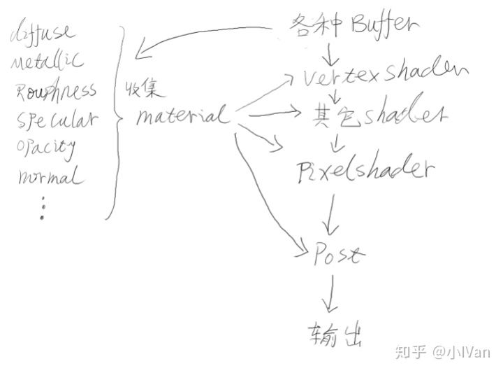

### 虚幻4渲染编程 [来源](https://zhuanlan.zhihu.com/c_187975189)

---------------------

#### [目录](https://zhuanlan.zhihu.com/p/36675543)

#### 虚幻4渲染编程之材质编辑器 [链接](https://zhuanlan.zhihu.com/p/36663720)

- 虚幻4渲染流程图

  - 
  
  - UE4的一个可视化节点就包含一段HLSL代码，通过我们的“连线”将HLSL代码拼接出来。最后会出一张ShaderTemplate文件。当我们点击材质编辑器的编译之后引擎会调用每个节点的Compile函数，把可视化节点的HLSL代码压入这个ShaderTemplate中。
  
  - 查看HLSLMaterialTranslator.h，充当翻译的角色，将可视化节点的HLSL代码压入到ShaderTemplate（MaterialTemplate.ush）中。
  
  - 首先我们在材质编辑器里编写的其实并不是shader，只是一片HLSL代码的字符串。并且这些材质节点全部都是c++代码。当我们编译材质的时候，MaterialExpression会将与之对应的HLSL代码提交给HLSLTranslator然后HLSLTranslator会把字符串翻译成HLSL代码然后和USF模板中的代码进行替换，最后才会得到我们需要的shadermap。虚幻的usf文件里面保存的不是shader，而是shader模板和各种函数。

#### 虚幻4渲染编程之Shader [链接](https://zhuanlan.zhihu.com/p/36630694)
- 

