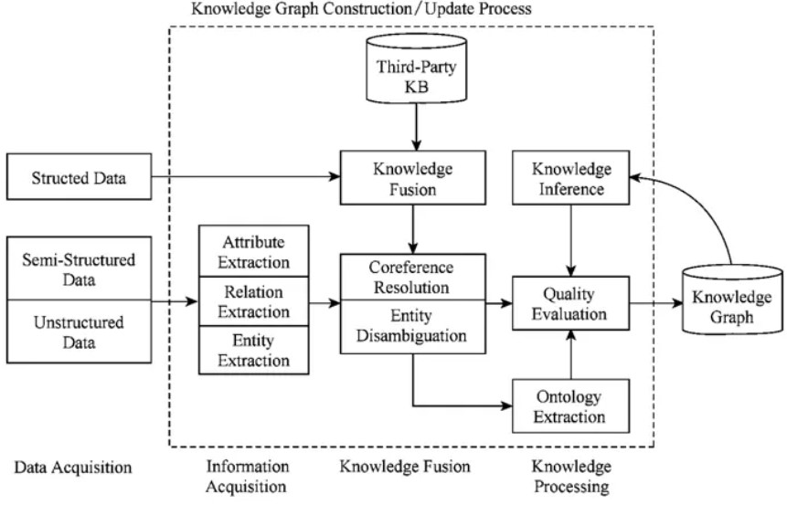
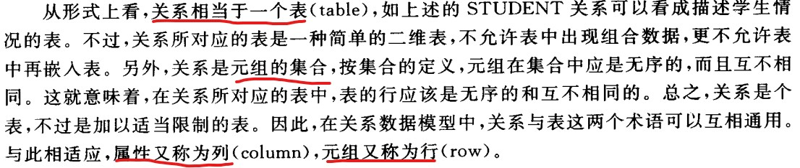
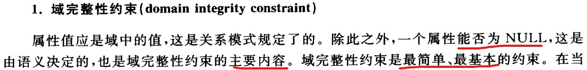
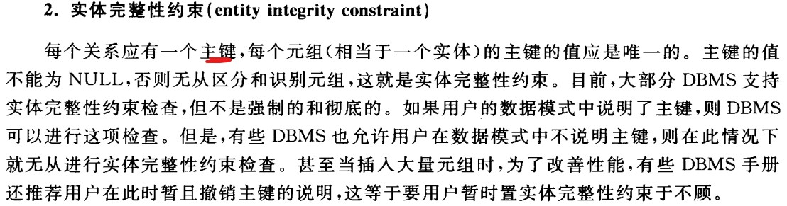
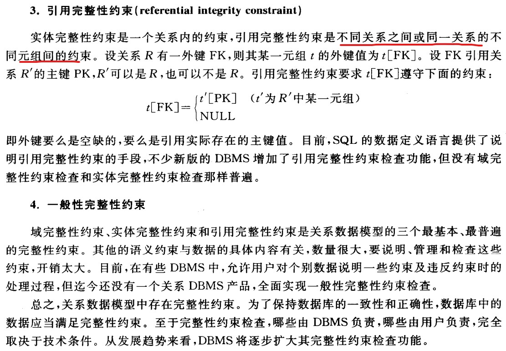
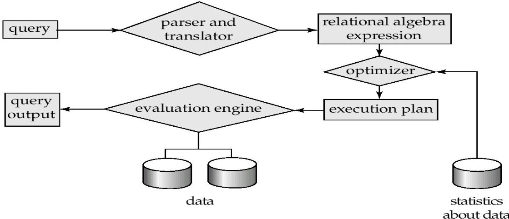
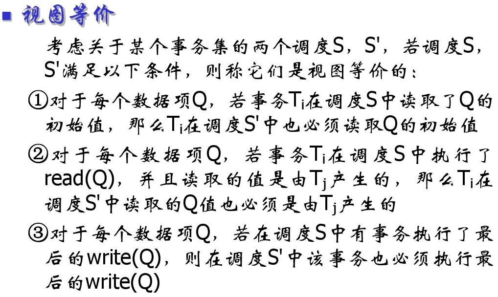
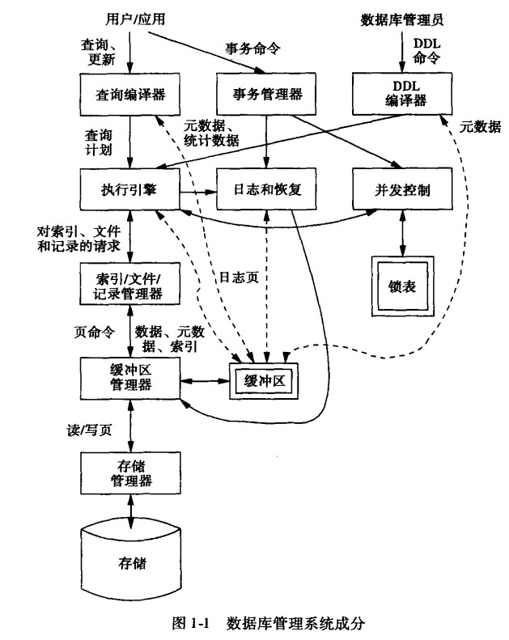
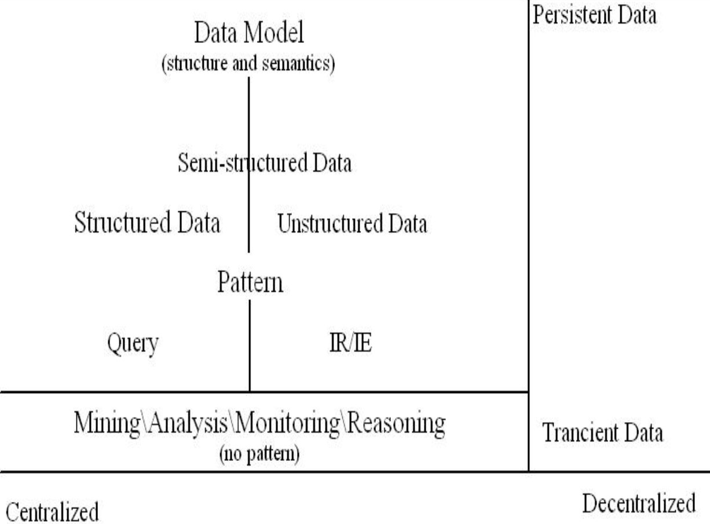

> 仅供参考，参考资料给出了链接，没有给出的部分来源数据库系统教程，第二版，王能斌

## 01 为什么需要知识图谱？[参考](https://zhuanlan.zhihu.com/p/31726910)

- 数据量越来越大，人们处理困难，而机器又无法获取网络文本的语义信息。为了让机器能够理解文本背后的含义，我们需要对可描述的事物（实体） 进行建模，填充它的属性，拓展它和其他事物的联系。即，构建机器的先验知识。
- 知识图谱是由一些相互连接的实体和他们的属性构成的。换句话说，知识图谱是由一条条知识组成，每条知识表示为一个SPO（Subject-Predicate-Object）三元组。知识图谱的数据来源有三个：结构化数据，半结构化数据（有一定组织形式，但较结构化数据而言更松散，如属性名和属性值有多样性，如生日，出生日期多种表达）和非结构化数据（通常指我们看到的一切纯文本数据）。
- 
- 作者专栏，还给出了建立知识图谱以及数据到关系数据库之间的映射。

## 02 数据库和深度学习的关系？（参考PPT）
- 数据库，一致性，可拓展，效率，显式结构（确定的，语法匹配）
- 深度学习，高维，不确定，隐式结构（不确定的，多模态数据的语义匹配）
	- 流形结构的深度神经网络模型表示：1. 高维复杂函数的近似 2. 层次结构特征抽取
	- 数据的语义关系，相似关系和相关关系
- 数据库和深度学习
  - 提高训练效率
  - 提供知识编码
  - 自动化DBA
  - 语义索引
  - 传递关系编码 

- 补充，参考去年数据库整理内容（后边的更好）
- 数据库对深度学习
	- 大量的训练集和数据模型提高了深度学习的准确性，但是副作用却是训练过程的代价的增大。正因如此数据库社区累积的大量的系统优化的经验可以用于深度学习训练集的优化。
	- 优化调度：通过优化数据库的事务执行和查询方法，来提高深度学习中相互独立问题的计算速度。例如数据库通过代价模型来评估查询计划的好坏。我们也可以建立一个深度学习代价模型来查找最优的计算次序。
	- 储存管理：深度学习需要大量的存储空间，可以通过优化页面和cache来优化调度；通过添加数据库日志取代静态的进行深度学习的运行分析，通过垃圾回收机制来优化GPU存储管理。
	- 并发性和一致性：数据库技术可以提供灵活的一致性用于深度学习的分布式训练。

- 深度学习对数据库
	-  深度学习结合了深度学习和计算机视觉领域，对于数据库中的某些非确定性问题，如知识融合，众包，查询推导等可能优化的较好
	-  自然语言查询接口：深度学习的RNN模型在解析自然语言领域有很好的表现，因此可以将RNN模型用于将自然语言查询语句解析为SQL查询语句，加以提炼用于数据库查询
	-  查询执行计划：对于QueryPlan 的优化是一个传统的数据库难题，我们可以训练一个Query Planner可以通过学习大量的SQL查询语句及其最优的执行顺序对新输入的SQL查询语句也可以产生相似的最优解。

## 03 数据库的逻辑模型
- 数据的结构，数据的操作，数据的约束
- 关系数据模型，层次模型和网状数据模型  [参考](https://www.cnblogs.com/daniumeng/p/8717438.html)
- 关系模型以二维表结构来表示事物（实体）与事物（实体）之间的联系
- 层次模型是指用一颗“有向树”的数据结构来表示表示各类实体以及实体间的联系，树中每一个节点代表一个记录类型，树状结构表示实体型之间的联系。（百科）
- 用有向图表示实体和实体之间的联系的数据结构模型称为网状数据模型

## 04 数据库和区块链（参考PPT）
- 数据库，一致性，可拓展，效率，中心化
- 区块链，共识，无需信任，去中心化（防抵赖，防篡改，可追溯，签名机制）
  - 区块链用数据加密学和工作量证明以及节点的共识的机制来保证数据的安全。
- 区块链数据库的特征：
  - 描述性的接口
  - 分布式数据库
  - **可编程去信任机制 **
  - **异构一致性/共识性语义**
  - 可拓展性
  - 并发事务调度和高吞吐

## 05 SQL和关系代数 [参考](https://www.cnblogs.com/instant7/p/4095882.html)
- 关系代数有五个基本运算符（选择，投影，叉乘，差，并），这五个基础运算符可以派生出其他组合运算符。
- SQL语句的执行一般是先翻译为关系代数再被执行的。
```C++
选择（σ， selection）相当于SQL语句中的where，表示选出满足一定条件的行。

如：σ rating>8 (S2）相当于 select * from S2 where rating>8;

投影（π， projection）相当于SQL语句中的select。。。distinct， 表示选择哪些列。注意：投影是会去重的！

如：π sname,rating (σ rating>8 (S2）)相当于 select sname, rating from S2 where rating>8;

叉乘（x， cross-product）相当于SQL语句中的from，表示穷举所有集合两边元素的组合量
如: AxB 相当于 select * from A, B;  注意：叉乘时两个集合不能有重名列

差（-, set-difference）R-S返回所有在R中而不在S中的元组

并（υ, union）RυS返回包含在R中或在S中的所有元组

合成运算符是由基础运算符组合派生而来的，算是一种速记标志。

交(∩, intersection) R∩S返回既在R中又在S中的元组。

自然连接(⋈， natural join)相当于先做叉乘，再选择公共属性一样的关系实例。如果没有公共属性的话，那么结果就是叉乘

除（÷， division）r÷s， 返回r中包含与s共有列但其他列不同的关系实例。
```
- 意义：（参考自去年数据库整理内容）
	- SQL是结构化查询语言，是描述性语言，语言结构简洁，功能强大，简单易学，SQL是高级的非过程化编程语言，SQL语言可以嵌套，使它具有极大的灵活性和强大的功能；

- 应用：
	- 人工智能的数据检索；用于存储数据以及查询、更新和管理关系数据库系统，同时也是数据库脚本文件的扩展名；

## 06 关系数据模型
- 数据结构关系（表格）

  - 
- 关系代数（参见05部分）
- 约束
	-  
	-  
	-  
- 完整性约束的实现：
	- 1. 用过程说明约束。将约束的说明和检验推给应用程序
	- 2. 用断言说明约束。 在SQL中，如下
		-   
	- 3. 在基表定义中添加check子句约束  
	- 4. 用触发子表示约束。当某事件发生时，如果满足给定条件，则执行相应的动作。

## 07 索引
- 为了查找方便，根据应用的需要，可在记录的某一属性或某一属性组上建立索引。索引中每一项由两部分组成，第一部分为索引键的值，第二部分为该值所对应的记录的地址或地址集。
- [B+树原理](https://github.com/CyC2018/CS-Notes/blob/master/docs/notes/MySQL.md#b-tree-%E5%8E%9F%E7%90%86)
   -  基于B树和叶子节点顺序访问指针实现。
      -  查找时，首先在根节点进行二分查找，找到一个key所在的指针，然后递归地在指针所指向的节点进行查找，直到查到叶子节点，然后在叶子节点上进行二分查找，找到key对应的data。
      -  插入，删除操作需要调整以维护平衡
      -  优点：
          -  查找时间复杂度等于树高log d N，d为每个节点的出度。
          -  利用磁盘预读特性。操作系统一般将内存和磁盘分割为固定的块，每块称为一页，内存和磁盘以页为单位交换数据。

 - 哈希索引
     - 能以O（1）时间进行查找，但是失去了有序性。
     - 无法排序与分组；只支持精确查找，无法用于部分查找和范围查找。 

- 索引的使用条件：
  - 对于非常小的表，大部分情况下简单的全表扫描比建立索引更高效。
  - 对于中到大型的表，索引就非常有效。
  - 对于特大型的表，建立和维护索引的代价将会随之增长。此时可用一种技术可以直接区分需要查询的一组 数据，而不是一条记录一条记录地匹配，例如分区技术。 

## 08 查询优化
- 查询过程
  -  
- 查询优化途径
  - 对查询语句进行变换，如改变基本操作的次序，称为代数优化。最常用的变换原则是，尽量缩减查询过程中的中间结果。如，让选择和投影先做，再做连接等二元操作。仅涉及查询语句本身，而不涉及存取路径。
  - 根据系统所提供的存取路径， 选择合理的存取策略，如选择顺序搜索还是索引，这称为物理优化。
  - 有些查询优化仅根据启发式规则，选择执行的策略，如先做选择，投影等一元操作，后做连接等，这叫规则优化。
  - 还有一些可以对可供选择的执行策略进行代价估算，从中选择代价最小的执行策略，这叫代价估算优化。
    - 处理查询时的时间开销，分为三个部分
    - 访问辅助存储器的代价，IO代价
    - 计算代价， CPU代价
    - 通信代价
  - 优化数据访问
    - 减少请求的数据量，如只返回必要的列或行 ，缓存重复查询的数据
    - 减少服务器端扫描的行数，如使用索引
  - 重构查询方式 
    - 切分大查询 ，分解大连接查询

## 09 事务管理
- 保证事务在故障时满足ACID准则的技术称为恢复；保证事务在并发执行时满足ACID准则的技术称为并发控制。这两项合称为事务管理。
    - 原子性 Atomic
        - 要么不做，要么全做。

    - 一致性 Consistency
        - 数据库中的数据满足完整性约束。

    - 隔离性 Isolation
        - 多个事务并发地执行，应像各个事务独立执行一样。

    - 持久性 Durability
        - 数据库因故障而受到破坏，其也应该能够恢复。
- 并发的目的
	- 改善系统的资源利用率和吞吐率（单位时间内处理的事务数） 
	- 改善短事务的响应时间（长的在前执行，短的等的太久。）

- 并发所引发的问题
	- 丢失更新，写写冲突
	- 读脏数据，读写冲突
	- 读值不可复现 ，读写冲突

- 并发控制的正确性准则
	- 调度S是对n个事务的所有操作的顺序的一个安排。同一事务集，调度可能有很多种 。
	- 如果其中两个调度S1和S，在数据库的任何初始状态下，所有读出的数据都是一样的，留给数据库的最终状态也是一样的，则S1和S2是等价的。目标等价和冲突等价。注意，冲突等价一定属于目标等价。
	- 不冲突的操作分为两类，1.一对操作都是读； 2. 虽然有写，但是作用的数据对象不一样。
	- 凡是通过调换S中不冲突操作所得到的新调度，称为S的冲突等价调度。
	- 对于事务集，如果一个调度与一个串行调度等价，则称该调度是**可串行化的**。
	-  

## 10 数据库的实现还是数据库管理系统的实现？？
- 数据库设计的基本过程
	- 1. 需求分析，确定数据库的用户和用途
	- 2. 概念设计。在需求分析的基础上，通常用概念数据模型，如E-R数据模型，表示数据及其相互间的联系。其与DBMS（Database Management System） 
	- 3. 逻辑设计。将概念数据模型，与DBMS无关的数据模式，转换成以DBMS的逻辑数据模型表示的逻辑模式。不是简单转换，而需要深入解决数据模式设计的技术问题，如数据模式的规范化，满足DBMS的各种限制。
	- 4. 物理设计。 设计数据库的内模式，即文件结构，各种存取路径，存储空间的分配，记录的存储格式等。

- 数据库管理系统成分
	- 

- 效率：
	- 结合前边查询优化，
	- 缓存（多采用[LRU](https://leetcode.com/problems/lru-cache/description/)置换算法）
	- 事务并发
	- 存储访问
		- 簇集设计，簇集就是把有关的元组集中到一个物理块内或物理上相邻的区域内，以提高数据的访问速度。 
		- 索引，看前边
		- 分区设计。数据库的存储介质一般由多个磁盘阵列构成。

- 可用：
	- 存储可靠，恢复和备份
	- 查询

- 可拓展性：
	- [分布式数据库](https://www.cnblogs.com/XQiu/p/5265980.html)
	- 你们编吧。 

## 11 现代数据库成就
- 关系数据模型
- 索引
- 查询优化
- 并发调度        （内容前边都有解释）

## 12 基于下图的解释
 

- [信息检索](https://baike.baidu.com/item/%E4%BF%A1%E6%81%AF%E6%A3%80%E7%B4%A2/831904?fr=aladdin)（Information Retrieval）广义的信息检索是信息按一定的方式进行加工、整理、组织并存储起来，再根据信息用户特定的需要将相关信息准确的查找出来的过程。又称信息的存储于检索。
- [知识提取](https://en.wikipedia.org/wiki/Information_extraction)（Information Extraction）自动地从非结构化或者结构化机器可读的文档中提取结构化数据。主要是在完成一系列分词、词性标注等NLP任务等的基础上，从打上词性标签的句子中提取信息。
- 结构化数据，可以使用关系数据库表示和存储，表现为二维形式的数据。
- 半结构化数据是结构化数据的一种形式，它并不符合关系型数据库或其他数据表的形式关联起来的数据模型结构，但包含相关标记，用来分隔语义元素以及对记录和字段进行分层。因此，它也被称为自描述的结构。
- 非结构化数据，没有固定结构的格式，如文档，图片，视频，音频等。[参考](https://www.cnblogs.com/xiaohanlin/p/7536639.html)


## 13 数据库和前沿科技
- 机器学习
- 区块链
- 知识图谱